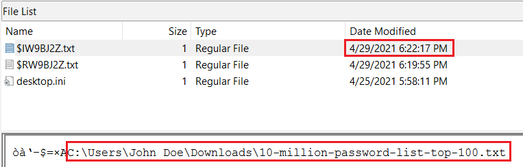
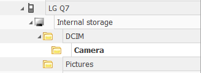

# AfricanFalls

- [AfricanFalls](#africanfalls)
  - [Overview](#overview)
  - [Answer List](#answer-list)
  - [Walkthrough](#walkthrough)
  - [References](#references)

## Overview
Answer list as well as the walkthrough for each question.

[Link to challenge page](https://cyberdefenders.org/blueteam-ctf-challenges/66#nav-overview)

The main tools used are:

- [BrowingHistoryView](https://www.nirsoft.net/utils/browsing_history_view.html) v2.5.6

- [FTK Imager](https://www.exterro.com/ftk-imager) v4.7.1.2

- [Hashcat](https://hashcat.net/hashcat/) v6.2.6, with the CrackStation [password list](https://crackstation.net/crackstation-wordlist-password-cracking-dictionary.htm) and [password rules](https://github.com/NotSoSecure/password_cracking_rules)

- [Kali Linux VM](https://www.kali.org/get-kali/) with [exiftool](https://exiftool.org/) v12.57 and [Impacket](https://github.com/fortra/impacket) v0.9.24

- [ShellBags Explorer](https://ericzimmerman.github.io/#!index.md) v1.4.0.0

- [WinPrefetchView](https://www.nirsoft.net/utils/win_prefetch_view.html) v1.3.7

## Answer List
**Q1: What is the MD5 hash value of the suspect disk?**
> 9471e69c95d8909ae60ddff30d50ffa1

**Q2: What phrase did the suspect search for on 2021-04-29 18:17:38 UTC? *(three words, two spaces in between)***
> password cracking lists

**Q3: What is the IPv4 address of the FTP server the suspect connected to?**
> 192.168.1.20

**Q4: What date and time was a password list deleted in UTC? *(YYYY-MM-DD HH:MM:SS UTC)***
> 2021-04-29 18:22:17 UTC

**Q5: How many times was Tor Browser ran on the suspect's computer? *(number only)***
> 0

**Q6: What is the suspect's email address?**
> dreammaker82@protonmail.com

**Q7: What is the FQDN did the suspect port scan?**
> dfir.science

**Q8: What country was picture "20210429_152043.jpg" allegedly taken in?**
> Zambia

**Q9: What is the parent folder name picture "20210429_151535.jpg" was in before the suspect copy it to "contact" folder on his desktop?**
> Camera

**Q10: A Windows password hashes for an account are below. What is the user's password? Anon:1001:aad3b435b51404eeaad3b435b51404ee:3DE1A36F6DDB8E036DFD75E8E20C4AF4:::**
> AFR1CA!

**Q11: What is the user "John Doe's" Windows login password?**
> ctf2021

<br>

## Walkthrough
**Load the image into FTK.**

Extract the challenge zip file. There will be two files:
- `DiskDrigger.ad1`
- `DiskDrigger.ad1.txt`

In FTK, click `File` -> `Add Evidence Item...` and select `DiskDrigger.ad1`.

It will show up as a Custom Content Image.

 <br>

**Export evidence files.**

Expand the `DiskDrigger.ad1` tree.

Right-click on `John Doe`, then click `Export Files...` and choose the destination. There may be errors, but that's okay.

---
<br>

**Q1: What is the MD5 hash value of the suspect disk?**
> 9471e69c95d8909ae60ddff30d50ffa1

Go to the extracted challenge files.

In `DiskDigger.ad1.txt`, look under the *Image Verification Results* for the hash value.

 <br>

---
<br>

**Q2: What phrase did the suspect search for on 2021-04-29 18:17:38 UTC? *(three words, two spaces in between)***
> password cracking lists

Launch BrowsingHistoryView.

Go to Options and ensure `Show Time in GMT` is checked.

Go to Options and `Advanced Options`.

For *Filter by visit date/time:*, select `Load history items from any time`.

Under *Load history from..*, select `Load history from the specified profile (For example: C:\users\admin)`.

Provide the location of the exported `John Doe` folder. For example, the path should end in: `[root]\Users\John Doe`.

 <br>

Sort by the results by *Visit Time* and find the matching timestamp `4/29/2021 6:17:38 PM`.

Right-click on the entry and click on `Properties`.

The search term will be listed in *Title*.

 <br>

---
<br>

**Q3: What is the IPv4 address of the FTP server the suspect connected to?**
> 192.168.1.20

Go to `[root]\Users\John Doe\AppData\Roaming\FileZilla\`.

Open `filezilla.xml` and scroll down to *Tabs* to find the IP address.

 <br>

---
<br>

**Q4: What date and time was a password list deleted in UTC? *(YYYY-MM-DD HH:MM:SS UTC)***
> 2021-04-29 18:22:17 UTC

Go to `[root]\$Recycle.Bin\S-1-5-21-3061953532-2461696977-1363062292-1001\`.

Open `$IW9BJ2Z.txt` to find the name of the password list. Also note the *Date Modified* timestamp.

 <br>

---
<br>

**Q5: How many times was Tor Browser ran on the suspect's computer? *(number only)***
> 0

Launch WinPrefetchView.

Go to Options and ensure `Show Time in GMT` is checked.

Go to Options and `Advanced Options`.

Provide the location of the exported `Prefetch` folder. For example, the path should end in: `[root]\Windows\Prefetch`.

 <br>

Under the *Filename* column, look for name starting with `TORBROWSER-INSTALL`.

 <br>

The rest of the list does nto show anything related to Tor Browser, likely indicating that it was installed but not run.

---
<br>

**Q6: What is the suspect's email address?**
> dreammaker82@protonmail.com

Use the same WinPrefetchView session as Q2.

Under the *URL* column, find `https://mail.proton.mail.com/inbox`.

The email address will be in the *Title*.

 <br>

---
<br>

**Q7: What is the FQDN did the suspect port scan?**
> dfir.science

Go to `[root]\Users\John Doe\AppData\Roaming\Microsoft\Windows\PowerShell\PSReadline\`.

Open `ConsoleHost_history.txt` and find the nmap command towards end of the list.

 <br>

---
<br>

**Q8: What country was picture "20210429_152043.jpg" allegedly taken in?**
> Zambia

Go to `[root]\Users\John Doe\Pictures\Contact\`.

Find `20210429_152043.jpg` and copy it over to the Kali VM.

```
scp 20210429_152043.jpg kera@192.168.56.103:/home/kera/cyberdefenders/AfricanFalls/20210429_152043.jpg
```

Use exiftool to find the GPS coordinates.

```
exiftool 20210429_152043.jpg
```

 <br>

Go to the [GPS Coordinates](https://gps-coordinates.org/) website.

Under *DMS (degrees, minutes, seconds)*, input the coordinates and click **Get Address**.

 <br>

The city and country will be returned.

 <br>

---
<br>

**Q9: What is the parent folder name picture "20210429_151535.jpg" was in before the suspect copy it to "contact" folder on his desktop?**
> Camera

Use exiftool to find the make and model of the camera used.
- Make: `LG Electronics`
- Model: `LM-Q725K`

```
exiftool 20210429_152043.jpg
```

 <br>

Launch ShellBags Explorer as admin

Click File then `Load Offline hive`.

Go to `[root]\Users\John Doe\AppData\Local\Microsoft\Windows\`.

Select `UsrClass.dat`.

Expand Desktop then My Computer.

Note the device named `LG Q7`. That is another name for the [LM-Q725K](https://www.phonemore.com/specs/lg/q7-plus/q725k/) phone. Expand the tree to find the folder name.

 <br>

---
<br>

**Q10: A Windows password hashes for an account are below. What is the user's password? Anon:1001:aad3b435b51404eeaad3b435b51404ee:3DE1A36F6DDB8E036DFD75E8E20C4AF4:::**
> AFR1CA!

Save the hash in username:hash format.
```
anon:3DE1A36F6DDB8E036DFD75E8E20C4AF4
```

Run hashcat in NTLM mode (`-m 1000`) with the CrackStation [password list](https://crackstation.net/crackstation-wordlist-password-cracking-dictionary.htm) and the OneRuleToRuleThemAll [rule file](https://github.com/NotSoSecure/password_cracking_rules).

```
hashcat -m 1000 --username --status -d 1 -O -a 0 -w 3 "C:\q10_anon.txt" -o "C:\q10_anon.txtcracked.txt" -r "C:\hashcat\rules\OneRuleToRuleThemAll.rule" "C:\hashcat\pw-lists\realhuman_phill.txt"
```

 <br>

---
<br>

**Q11: What is the user "John Doe's" Windows login password?**
> ctf2021

Go to `[root]\Windows\System32\config\`.

Find the `SAM` and `SYSTEM` files and copy them over to the Kali VM.

```
scp SAM kera@192.168.56.103:/home/kera/cyberdefenders/AfricanFalls/SAM
scp SYSTEM kera@192.168.56.103:/home/kera/cyberdefenders/AfricanFalls/SYSTEM
```

Use impacket-secretsdump to find the NTLM hash for John Doe.

```
impacket-secretsdump -system SYSTEM -sam SAM LOCAL
```

 <br>

Save the hash in username:hash format.
```
John Doe:ecf53750b76cc9a62057ca85ff4c850e
```

Run hashcat in NTLM mode (`-m 1000`) with the CrackStation [password list](https://crackstation.net/crackstation-wordlist-password-cracking-dictionary.htm) and the OneRuleToRuleThemAll [rule file](https://github.com/NotSoSecure/password_cracking_rules).

```
hashcat -m 1000 --username --status -d 1 -O -a 0 -w 3 “C:\q11_johndoe.txt” -o “C:\q11_johndoe_cracked.txt” -r "C:\hashcat\rules\OneRuleToRuleThemAll.rule" "C:\hashcat\pw-lists\realhuman_phill.txt"
```

 <br>

## References
[ShellBags](https://www.giac.org/paper/gcfa/9576/windows-shellbag-forensics-in-depth/128522)