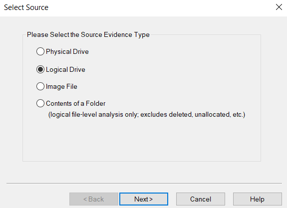

# SysInternals

- [SysInternals](#sysinternals)
  - [Overview](#overview)
  - [Answer List](#answer-list)
  - [Walkthrough](#walkthrough)
  - [References](#references)

## Overview
Answer list as well as the walkthrough for each question.

[Link to challenge page](https://cyberdefenders.org/blueteam-ctf-challenges/100#nav-overview)

Category: Endpoint Forensics

Tools used:
- [FTK Imager](https://www.exterro.com/ftk-imager) v4.7.1.2
- [IECacheView](https://www.nirsoft.net/utils/ie_cache_viewer.html) v1.58
- [Registry Explorer](https://ericzimmerman.github.io/#!index.md) v2.0.0.0
- [Strings](https://learn.microsoft.com/en-us/sysinternals/downloads/strings) v2.54
- VirusTotal

## Answer List
**Q1: What was the malicious executable file name that the user downloaded?**
> 9471e69c95d8909ae60ddff30d50ffa1

**Q2: When was the last time the malicious executable file was modified? 12-hour format**
> 11/15/2022 09:18:51 PM

**Q3: What is the SHA1 hash value of the malware?**
> fa1002b02fc5551e075ec44bb4ff9cc13d563dcf

**Q4: What is the malware's family?**
> rozena

**Q5: What is the first mapped domain's Fully Qualified Domain Name (FQDN)?**
> www.malware430.com

**Q6: The mapped domain is linked to an IP address. What is that IP address?**
> 192.168.15.10

**Q7: What is the name of the executable dropped by the first-stage executable?**
> vmtoolsIO.exe

**Q8: What is the name of the service installed by 2nd stage executable?**
> VMwareIOHelperService

**Q9: What is the extension of files deleted by the 2nd stage executable?**
> pf

## Walkthrough
**Load the image into FTK**

Extract zip file. Only one file:
- `SysInternals.E01`

In FTK, click `File` -> `Image Mounting...` and mount `SysInternals.E01` as a drive. *Example uses E drive.*

 <br>

Nothing will show up in the main FTK screen.

Click `File` -> `Add Evidence Item...` -> `Logical Drive`.

 <br>

Select the new drive from the dropdown menu.

 <br>

It should appear in the Evidence Tree.

 <br>

---
<br>

**Q1: What was the malicious executable file name that the user downloaded?**
> 9471e69c95d8909ae60ddff30d50ffa1

The executable is at `[root]\Users\Public\Downloads\SysInternals.exe`.

 <br>

---
<br>

**Q2: When was the last time the malicious executable file was modified? 12-hour format**
> 11/15/2022 09:18:51 PM

Select SysInternals.exe

On the Properties window, see **Date Modified** for the timestamp.

 <br>

---
<br>

**Q3: What is the SHA1 hash value of the malware?**
> fa1002b02fc5551e075ec44bb4ff9cc13d563dcf

Open Registry Explorer (may need admin privileges).

Navigate to `File -> Load hive`.

Select `[root]\Windows\appcompat\Programs\Amcache.hve`

Expand `InventoryApplicationFile`.

 <br>

Select `Select sysinternals.exe|1a80e611058c98e5`.

See **File Id** for the hash.

 <br>

---
<br>

**Q4: What is the malware's family?**
> rozena

Go to VirusTotal and search for the hash from Q3.

Click on the `DETECTION` tab, look at **Family labels**.

 <br>

---
<br>

**Q5: What is the first mapped domain's Fully Qualified Domain Name (FQDN)?**
> www.malware430.com

Search for the SHA1 hash in VirusTotal

Click on the `RELATIONS` tab and look under **Contacted Domains**.

 <br>

---
<br>

**Q6: The mapped domain is linked to an IP address. What is that IP address?**
> 192.168.15.10

Navigate to `[root]\Windows\System32\drivers\etc` and open the `hosts` file to find the name and IP mapping.

 <br>

---
<br>

**Q7: What is the name of the executable dropped by the first-stage executable?**
> vmtoolsIO.exe

An attempt was made to run Strings on the malicious `Sysinternals.exe` but no results came back. In addition, CyberChef also did not find any strings and an upload to VirusTotal came back clean. These outcomes were all unexpected. Luckily, IECacheView was able to locate another copy.

In FTK, right-click on `[root]\Windows\IEUser` and click `Export Files...`

Launch IE Cache View and navigate to `File -> Select Cache Folder`.

Select `\IEUser\AppData\Local\Microsoft\Windows\WebCache` and click **OK**.

 <br>

Locate and right-click on `SysInternals[1].exe`, then click on Properties to see the **Full Path**.

The file can be found at `\IEUser\AppData\Local\Packages\microsoft.microsoftedge_8wekyb3d8bbwe\AC\#!001\MicrosoftEdge\Cache\WMFWC1O7\SysInternals[1].exe`.

Run Strings on `SysInternals[1].exe`.
```
strings -nobanner \IEUser\AppData\Local\Packages\microsoft.microsoftedge_8wekyb3d8bbwe\AC\#!001\MicrosoftEdge\Cache\WMFWC1O7\SysInternals[1].exe
```

Scroll down a bit to find the reference to `vmtoolsIO.exe`.

 <br>

We can also double check by looking at the AppCompatCache, located in the SYSTEM hive.

Launch RegistryExplorer with admin privileges and navigate to `File -> Load hive`.

Select `[root]\Windows\System32\config\SYSTEM`.

Navigate to `[ROOT]\ControlSet001\Control\Session Manager\AppCompatCache`

In the top right window, select the **AppCompatCache** key.

 <br>

In the bottom right window, select the **AppCompatCache** tab and sort by **Modified Time**.

Notice that `vmtoolsIO.exe` was run shortly after the malicious SysInternals.

 <br>

---
<br>

**Q8: What is the name of the service installed by 2nd stage executable?**
> VMwareIOHelperService

In the Strings output from Q7, we can see the service name referenced by the `net start` and `sc config` commands.

 <br>

---
<br>

**Q9: What is the extension of files deleted by the 2nd stage executable?**
> pf

In FTK, right-click on `[root]\Windows\vmtoolsIO.exe` and click `Export Files...`

Run Strings on `vmtoolsIO.exe`.
```
strings -nobanner vmtoolsIO.exe
```

Scroll down to find references to `*.pf` and `C:\Windows\Prefetch`.

 <br>

In FTK, navigate to `[root]\Windows\PreFetch`.

There is a deleted file named `VMTOOLSIO.EXE-B05FE979.pf` with a timestamp that is close to when the malicious SysInternals and vmtoolsIO were run.

 <br>

## References
[Amcache and AppCompatCache](https://andreafortuna.org/2017/10/16/amcache-and-shimcache-in-forensic-analysis/)