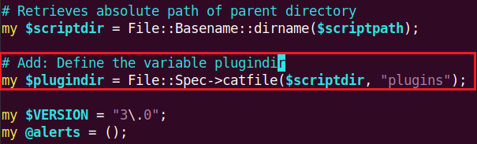
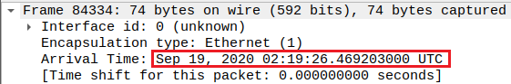
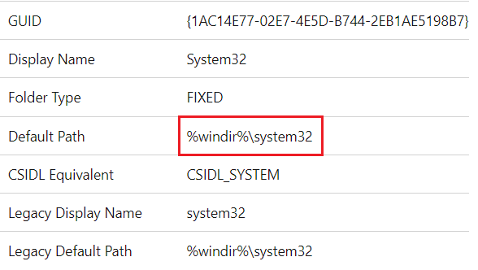

# Szechuan Sauce

- [Szechuan Sauce](#szechuan-sauce)
  - [Overview](#overview)
  - [Answer List](#answer-list)
  - [Walkthrough](#walkthrough)
  - [References](#references)

## Overview
Answer list and walkthrough for each question.

Category: Endpoint Forensics

[Link to challenge page](https://cyberdefenders.org/blueteam-ctf-challenges/31#nav-overview)

[Link to briefing](https://dfirmadness.com/the-stolen-szechuan-sauce/)

SIFT running Ubuntu 20.04.2 was used as the Linux machine. Most of the tools used are pre-installed.
- ClamAV Scanner v0.103.2 (clamscan)
- ewfmount
- [Impacket](https://github.com/fortra/impacket) v0.9.24 - Need to install separately
- mmls
- RegRipper v3.0
- Volatility v2.6.1
- Wireshark v3.2.3

Windows tools used:
- [FTK Imager](https://www.exterro.com/ftk-imager) v4.7.1.2
- Windows Event Log

Web based tools:
- [CrackStation](https://crackstation.net/)
- [VirusTotal](https://www.virustotal.com/gui/home/upload)

## Answer List
**Q1: What’s the Operating System version of the Server? *(two words)***
> 2012 R2

**Q2: What’s the Operating System of the Desktop? *(four words separated by spaces)***
> Windows 10 Enterprise Evaluation

**Q3: What was the IP address assigned to the domain controller?**
> 10.42.85.10

**Q4: What was the timezone of the Server?**
> UTC-6

**Q5: What was the initial entry vector (how did they get in)?. Provide protocol name.**
> RDP

**Q6: What was the malicious process used by the malware? *(one word)***
> coreupdater

**Q7: Which process did malware migrate to after the initial compromise? *(one word)***
> spoolsv

**Q8: Identify the IP Address that delivered the payload.**
> 194.61.24.102

**Q9: What IP Address was the malware calling to?**
> 203.78.103.109

**Q10: Where did the malware reside on the disk?**
> C:\Windows\System32\coreupdater.exe

**Q11: What's the name of the attack tool you think this malware belongs to? *(one word)***
> Metasploit

**Q12: One of the involved malicious IP's is based in Thailand. What was the IP?**
> 203.78.103.109

**Q13: Another malicious IP once resolved to klient-293.xyz . What is this IP?**
> 194.61.24.102

**Q14: The attacker performed some lateral movements and accessed another system in the environment via RDP. What is the hostname of that system?**
> DESKTOP-SDN1RPT

**Q15: Other than the administrator, which user has logged into the Desktop machine? *(two words)***
> Rick Sanchez

**Q16: What was the password for "jerrysmith" account?**
> !BETHEYBOO12!

**Q17: What was the original filename for Beth’s secrets?**
> SECRET_beth.txt

**Q18: What was the content of Beth’s secret file? *(six words, spaces in between)***
> Earth beth is the real beth

**Q19: The malware tried to obtain persistence in a similar way to how Carbanak malware obtains persistence. What is the corresponding MITRE technique ID?**
> T1543.003

<br>

## Walkthrough

**Load the disk images into FTK**

Extract the challenge zip file. There will be images for both the client and server, each split into multiple EnCase files. The ones we to look for are:
- `20200918_0417_DESKTOP-SDN1RPT.E01`
- `E01-DC01/20200918_0347_CDrive.E01`

In FTK, click `File` -> `Add Evidence Item...` and select each image.

**Mount the disk images in SIFT**

Extract the challenge zip file inside of SIFT. Look for the same images as above.

Mount the client image.
```
mkdir /mnt/ewf/sdn1rpt

ewfmount 20200918_0417_DESKTOP-SDN1RPT.E01 /mnt/ewf/sdn1rpt
```

Mount the server image.
```
mkdir /mnt/ewf/dc01

ewfmount E01-DC01/20200918_0347_CDrive.E01 /mnt/ewf/dc01
```

The mounted images will be accessible at: `/mnt/ewf/sdn1rpt/ewf1` and `/mnt/ewf/dc01/ewf1`.

 <br>

Get the location of the OS partitions.
```
mmls /mnt/ewf/sdn1rpt/ewf1
```

 <br>

```
mmls /mnt/ewf/dc01/ewf1
```

 <br>

The starting sectors of our images are:
- Client: `239616`
- Server: `718848`

Mount the client OS partition, specifying the starting sector in the offset.
```
mount -t ntfs-3g -o loop,ro,show_sys_files,stream_interface=windows,offset=$((239616*512)) /mnt/ewf/sdn1rpt/ewf1 /mnt/windows_mount/
```

 <br>

Mount the server OS partition.
```
mount -t ntfs-3g -o loop,ro,show_sys_files,stream_interface=windows,offset=$((718848*512)) /mnt/ewf/dc01/ewf1 /mnt/windows_mount1/
```

 <br>

**Verify Volatility profiles**

Get profile for the client memory dump: `Win10x64_19041`.

```
vol.py -f DESKTOP-SDN1RPT.mem imageinfo | tee case/sdn1rpt/imageinfo.txt
```

 <br>

Get profile for the server memory dump: `Win2012R2x64_18340`.

Multiple profiles were suggested but this one ended up worked (even though the build version doesn't match) while the others did not.

```
vol.py -f citadeldc01.mem imageinfo | tee case/dcn01/imageinfo.txt
```

 <br>

**Fix regripper plugindir error in SIFT**

regripper wouldn't run due to not knowing its plugin directory. Thanks to **jrick** for [providing a fix](https://obscurite.hateblo.jp/entry/2022/02/28/003408).

Open `/usr/share/regripper.pl` and define the `plugindir` variable beginning at line 66:
```
# Add: Define the variable plugindir
my $plugindir = File::Spec->catfile($scriptdir, "plugins");
```

 <br>

---
<br>

**Q1: What’s the Operating System version of the Server? *(two words)***
> 2012 R2

Use regripper to parse the SOFTWARE registry hive, located at `/mnt/windows_mount1/Windows/System32/config/SOFTWARE`.
 
```
rip.pl -r /mnt/windows_mount1/Windows/System32/config/SOFTWARE -f software > case/dc01/software.txt
```

Search for *ProductName* to find the OS.

 <br>

---
<br>

**Q2: What’s the Operating System of the Desktop? *(four words separated by spaces)***
> Windows 10 Enterprise Evaluation

Use regripper to parse the SOFTWARE registry hive, located at `/mnt/windows_mount/Windows/System32/config/SOFTWARE`.

```
rip.pl -r /mnt/windows_mount/Windows/System32/config/SOFTWARE -f software > case/sdn1rpt/software.txt
```

Search for *ProductName* to find the OS.

 <br>

---
<br>

**Q3: What was the IP address assigned to the domain controller?**
> 10.42.85.10

Open the packet capture `case001.pcap`.

Use the display filter: `browser`.

See the *Host Announcements* from 10.42.85.10 indicating it is a domain controller.

 <br>

---
<br>

**Q4: What was the timezone of the Server?**
> UTC-6

Use regripper to parse the SYSTEM registry hive, located at `/mnt/windows_mount/Windows/System32/config/SYSTEM`.

```
rip.pl -r /mnt/windows_mount1/Windows/System32/config/SYSTEM -f system > case/dc01/system.txt
```

Search for *TimeZoneInformation* to find the configured timezone.

 <br>

**However**, the case [briefing]((https://dfirmadness.com/the-stolen-szechuan-sauce/)) notes that the incident took place in Colorado, at UTC-6.

 <br>

---
<br>

**Q5: What was the initial entry vector (how did they get in)?. Provide protocol name.**
> RDP

Export the server's Security event log.
1. From FTK, expand the `20200918_0347_CDrive.E01` tree -> Partition 2 [11168MB].
2. Go to `[root]\Windows\System32\winevt\Logs`. Right-click `Security.evt` and `Export Files...`.

Open in Windows Event Viewer.
1. Right-click on `Saved Logs`.
2. `Open Saved Log...`.

Filter for successful RDP events.
1. Under Saved Logs, select the Security log.
2. Click `Filter Current Log...`.
3. Filter for Event ID `4624`.

 <br>

Look for the event at **9/18/2020 8:21:48 PM**.
> This was viewed in Pacific time. Adjust for local timezone.

The *Logon Type* of 10 means it is an RDP login and the source IP can be found at *Source Network Address*.

 <br>

Another note about time: in the XML details, the time is displayed is **9/18/2020 03:21:48 UTC** and is around the time when lots of RDP attempts are seen. 

However, if we look in the packet capture `case001.pcap` with the display filter `tcp.port == 3389`, we see numerous RDP connections starting around **9/19/2020 02:19:26 UTC** (packet #84334), matching what's seen above.

 <br>

This is strange because even if the timezone was incorrectly set on the server, the UTC timestamp would still be correct. Moving an hour backwards in the Windows log and an hour forward in the packet capture didn't show RDP activity.

---
<br>

**Q6: What was the malicious process used by the malware? *(one word)***
> coreupdater

View `case001.pcap` using the display filter: `ip.addr == 194.61.24.102 && http`.

Notice the GET requests for `/coreupdater.exe`.

 <br>

Extract network connections from the server's memory.
```
vol.py -f citadeldc01.mem --profile=Win2012R2x64_18340 netscan | tee case/dc01/netscan.txt
```

The output is noisy and contains lots of DNS-related entries. Filter it out.
```
grep -v dns.exe case/dc01/netscan.txt
```

Find the outbound connection by `coreupdater.exe` to `203.78.103.109:443`.

 <br>

Update the Wireshark display filter to include the new IP and port: `(ip.addr == 194.61.24.102 && http) || (ip.addr == 203.78.103.109 && tcp.port == 443)`.

Notice this new connection took place after the initial download of coreupdater.

 <br>

---
<br>

**Q7: Which process did malware migrate to after the initial compromise? *(one word)***
> spoolsv

Scan the server's memory to try and find known malware.
```
mkdir case/dc01/malfind
vol.py -f citadeldc01.mem --profile=Win2012R2x64 malfind -D case/dc01/malfind/ | tee case/dc01/malfind.txt
```

The text output of malfind gives us readable information about suspicious memory segments and includes the process name, ID, and the starting address. The directory specified with `-D` will contain dumps of those same segments.

 <br>

Scan the suspicious memory dumps with ClamAV.
```
clamscan --log=case/dc01/clamscan_malfind_results.txt case/dc01/malfind/
```

 <br>

There are a few entries labeled with Meterpreter. Note those memory addresses.

Search the malfind text output for one of the memory addresses to find the process. The example will use `0x4afc070000`.

 <br>

Another interesting finding is the contents of `0x4afc070000` can be seen in the packet capture.

View the pcap using the display filter: `tcp.stream == 30455`.

This is one of the suspicious network connections identified in Q6.

Click on *packet #242207*, right-click *Follow -> TCP Stream*.

At the bottom of the window, go to Show and save data as and select Hex Dump from the dropdown menu.
	
This is the same data as seen in the malfind output.

 <br>

---
<br>

**Q8: Identify the IP Address that delivered the payload.**
> 192.61.24.102

Found in Q6 that the server downloaded coreupdater.exe from 194.61.24.102.

View `case001.pcap` using the display filter: `ip.addr == 194.61.24.102 && http`.

 <br>

---
<br>

**Q9: What IP Address was the malware calling to?**
> 203.78.103.109

Found in Q6 that coreupdater.exe was making an outbound connection from the server to 203.78.103.709.

View `case001.pcap` using the display filter: `(ip.addr == 194.61.24.102 && http) || (ip.addr == 203.78.103.109 && tcp.port == 443)`.

 <br>

---
<br>

**Q10: Where did the malware reside on the disk?**
> C:\Windows\System32\coreupdater.exe

Use regripper to parse the server's NTUSER.DAT registry hive, located at `/mnt/windows_mount1/Users/Administrator/NTUSER.DAT`.
```
rip.pl -r /mnt/windows_mount1/Users/Administrator/NTUSER.DAT -f ntuser -a > case/dc01/ntuser.txt
```

Find coreupdater.exe under *OpenSavePidlMRU*.

The path includes *My Computer\CLSID_Downloads*, which doesn't seemingly doesn't map to other directories.

 <br>

The executable will also show up under *UserAssist* with a path that includes *{1AC14E77-02E7-4E5D-B744-2EB1AE5198B7}*.

 <br>

Microsoft [documentation](https://learn.microsoft.com/en-us/windows/win32/shell/knownfolderid) shows this GUID maps to SYSTEM32.

 <br>

`/mnt/windows_mount1/Windows/System32` contains coreupdater.
```
ls -l /mnt/windows_mount1/Windows/System32 | grep coreupdater.exe
```

 <br>

Let's double check via another method.

Get the SHA-256 hash of the file.
```
sha256sum /mnt/windows_mount1/Windows/System32/coreupdater.exe
```

 <br>

The hash is flagged as malicious in [VirusTotal](https://www.virustotal.com/gui/file/10f3b92002bb98467334161cf85d0b1730851f9256f83c27db125e9a0c1cfda6/details).

 <br>

---
<br>

**Q11: What's the name of the attack tool you think this malware belongs to? *(one word)***
> Metasploit

Identified via ClamAV scan in Q7.

 <br>

---
<br>

**Q12: One of the involved malicious IP's is based in Thailand. What was the IP?**
> 203.78.103.109

Found in Q6 that there were strange connections to 194.61.24.102 and 203.78.103.709.

VirusTotal [lookup](https://www.virustotal.com/gui/ip-address/203.78.103.109) indicates 203.78.103.709 from an ISP in Thailand.

 <br>

---
<br>

**Q13: Another malicious IP once resolved to klient-293.xyz. What is this IP?**
> 194.61.24.102

VirusTotal [lookup](https://www.virustotal.com/gui/domain/klient-293.xyz/relations) indicates 194.61.24.102 once resolved to klient-293.xyz.

 <br>

---
<br>

**Q14: The attacker performed some lateral movements and accessed another system in the environment via RDP. What is the hostname of that system?**
> DESKTOP-SDN1RPT

The client's Security event log on shows a sucessful RDP connection from the server.
- The steps to export and view RDP events are the same as in Q5.

 <br>

---
<br>

**Q15: Other than the administrator, which user has logged into the Desktop machine? *(two words)***
> Rick Sanchez

The client's Security event log shows a sucessful RDP login with the `ricksanchez` account.
- The steps to export and view RDP events are the same as in Q5.

 <br>

---
<br>

**Q16: What was the password for "jerrysmith" account?**
> !BETHEYBOO12!

Use impacket-secretsdump to get password hashes for the domain accounts.
- The server's SYSTEM and NTDS registry hives are provided as input.
```
impacket-secretsdump -system /mnt/windows_mount1/Windows/System32/config/SYSTEM -ntds /mnt/windows_mount1/Windows/NTDS/ntds.dit LOCAL > case/dc01/secretsdump_ntds_output.txt
```

 <br>

Submit the hash to CrackStation to for the cleartext password.

 <br>

---
<br>

**Q17: What was the original filename for Beth’s secrets?**
> SECRET_beth.txt

Go to `'/mnt/windows_mount1/$Recycle.Bin/S-1-5-21-2232410529-1445159330-2725690660-500'`.

The filename can be found in `'$IU2L112.txt'`.

 <br>

---
<br>

**Q18: What was the content of Beth’s secret file? (six words, spaces in between)**
> Earth beth is the real beth

Go to `'/mnt/windows_mount1/$Recycle.Bin/S-1-5-21-2232410529-1445159330-2725690660-500'`.

The filename can be found in `'$RU2L112.txt'`.

 <br>

---
<br>

**Q19: The malware tried to obtain persistence in a similar way to how Carbanak malware obtains persistence. What is the corresponding MITRE technique ID?**
> T1543.003

coreupdater is configured to auto-run as a service. This can be seen in `autorunsc-citadel-dc01.csv`.

 <br>

This [writeup](https://www.trendmicro.com/en_us/research/21/d/carbanak-and-fin7-attack-techniques.html) describes how Carbanak installs itself as an auto-run service.

---
<br>

## References
[Malfind tutorial](https://volatility-labs.blogspot.com/2016/08/automating-detection-of-known-malware.html)

[Malfind reference](https://github.com/volatilityfoundation/volatility/wiki/Command-Reference-Mal#malfind)

[Mounting the E01 files in SIFT](https://dfirmadness.com/mounting-case001-e01-files/)