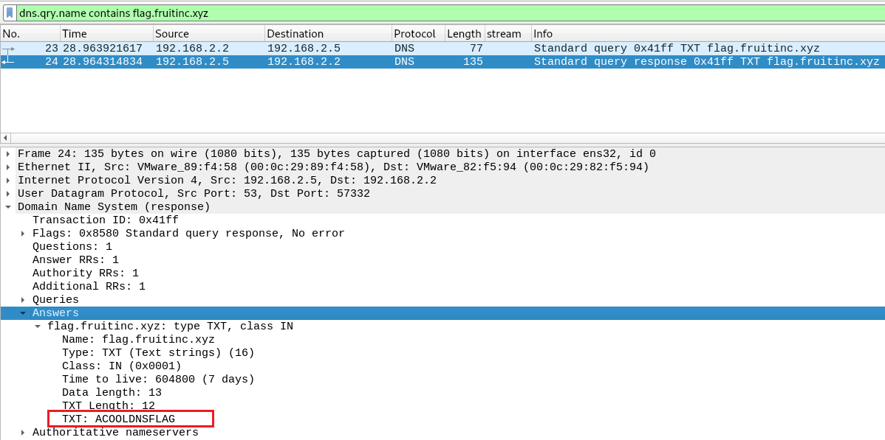
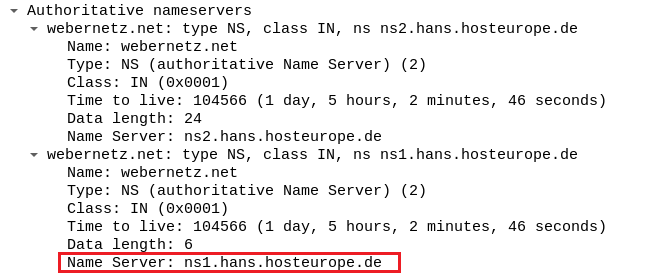
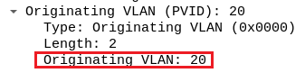
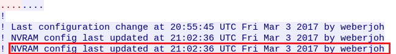
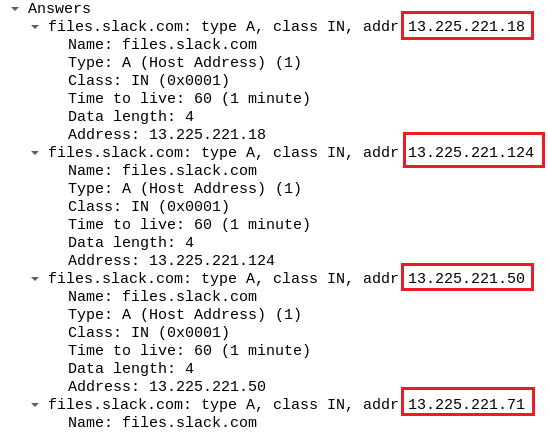
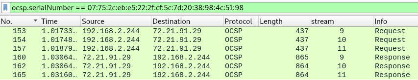

# WireDive (Difficulty: Medium)

- [WireDive (Difficulty: Medium)](#wiredive-difficulty-medium)
  - [Overview](#overview)
  - [Answer List](#answer-list)
  - [Walkthrough](#walkthrough)
    - [DHCP](#dhcp)
  - [DNS](#dns)
    - [SMB](#smb)
    - [Shell](#shell)
    - [Network](#network)
    - [HTTPS](#https)
  - [References](#references)

## Overview
Answer list as well as the walkthrough for each question.

[Link to challenge page](https://cyberdefenders.org/blueteam-ctf-challenges/37#nav-overview)

## Answer List
**Q1: What IP address is requested by the client?**
> 192.168.2.244

**Q2: What is the transaction ID for the DHCP release?**
> 0x9f8fa557

**Q3: What is the MAC address of the client?**
> 00:0c:29:82:f5:94

**Q4: What is the response for the lookup for flag.fruitinc.xyz?**
> ACOOLDNSFLAG

**Q5: Which root server responds to the google.com query? Hostname.**
> e.root-servers.net

**Q6: What is the path of the file that is opened?**
> HelloWorld\TradeSecrets.txt

**Q7: What is the path of the file that is opened?**
> 0xc000006d

**Q8: What is the tree that is being browsed?**
> \\\192.168.2.10\public

**Q9: What is the flag in the file?**
> OneSuperDuperSecret

**Q10: What port is the shell listening on?**
> 4444

**Q11: What is the port for the second shell?**
> 9999

**Q12: What version of netcat is installed?**
> 1.10-41.1

**Q13: What file is added to the second shell**
> /etc/passwd

**Q14: What password is used to elevate the shell?**
> *umR@Q%4V&RC

**Q15: What is the OS version of the target system?**
> bionic

**Q16: How many users are on the target system?**
> 31

**Q17: What is the IPv6 NTP server IP?**
> 2003:51:6012:110::dcf7:123

**Q18: What is the first IP address that is requested by the DHCP client?**
> 192.168.20.11

**Q19: What is the first authoritative name server returned for the domain that is being queried?**
> ns1.hans.hosteurope.de

**Q20: What is the number of the first VLAN to have a topology change occur?**
> 20

**Q21: What is the port for CDP for CCNP-LAB-S2?**
> GigabitEthernet0/2

**Q22: What is the MAC address for the root bridge for VLAN 60?**
> 00:21:1b:ae:31:80

**Q23: What is the IOS version running on CCNP-LAB-S2?**
> 12.1(22)EA14

**Q24: What is the virtual IP address used for hsrp group 121?**
> 192.168.121.1

**Q25: How many router solicitations were sent?**
> 3

**Q26: What is the management address of CCNP-LAB-S2?**
> 192.168.121.20

**Q27: What is the interface being reported on in the first snmp query?**
> Fa0/1

**Q28: When was the NVRAM config last updated?**
> 21:02:36 03/03/2017

**Q29: When was the NVRAM config last updated?**
> 2001:DB8::1812

**Q30: What has been added to web interaction with web01.fruitinc.xyz?**
> y2*Lg4cHe@Ps

**Q31: What is the name of the photo that is viewed in slack?**
> get_a_new_phone_today__720.jpg

**Q32: What is the username and password to login to 192.168.2.1 *Format: 'username:password' without quotes.***
> admin:Ac5R4D9iyqD5bSh

**Q33: What is the certStatus for the certificate with a serial number of 07752cebe5222fcf5c7d2038984c5198?**
> good

**Q34: What is the email of someone who needs to change their password?**
> Jim.Tomato@fruitinc.xyz

**Q35: A service is assigned to an interface. What is the interface, and what is the service? *Format: interface_name:service_name***
> lan:ntp

<br>

## Walkthrough

### DHCP
**Q1: What IP address is requested by the client?**
> 192.168.2.244

Use the display filter: `dhcp`.

Click on *packet #186* (DHCP Discover).

Scroll down to *Option: (50) Requested IP Address*.

 <br>

<br>

**Q2: What is the transaction ID for the DHCP release?**
> 0x9f8fa557

Use the display filter: `dhcp`.

Click on *packet #176*.

Note the *Transaction ID* in the Info column or at the start of the DHCP header.

 <br>

<br>

**Q3: What is the MAC address of the client?**
> 00:0c:29:82:f5:94

Use the display filter: `dhcp`.

Click on *packet #176*.

Click on the Ethernet header and note the MAC address at *Source*.

 <br>

<br>

## DNS
**Q4: What is the response for the lookup for flag.fruitinc.xyz?**
> ACOOLDNSFLAG

Use the display filter: `dns.qry.name contains flag.fruitinc.xyz`.

Click on *packet #23* (DNS response).

Expand the *Answers* section. Note the flag at *TXT:* .

 <br>

<br>

**Q5: Which root server responds to the google.com query? Hostname.**
> e.root-servers.net

Use the display filter: `dns.qry.name contains google.com`.

The First DNS request (*packet #1*) shows the client asking a local resolver for a list of root servers. The response in *packet #2* contains a list of hostnames for the root servers but no IP addresses.

In *packet #3*, the client asks a root server (192.203.230.10) about google.com. 

Doing an nslookup gives us the root server's hostname.
```
nslookup 192.203.230.10
```
 <br>

<br>

### SMB
**Q6: What is the path of the file that is opened?**
> HelloWorld\TradeSecrets.txt

Use the display filter: `smb2.cmd == 5 && smb2.file_attribute.directory == 0`.
- `smb2.cmd == 5` shows Create Request and Create Response traffic, used when trying to access a file or directory.
- `smb2.file_attribute.directory == 0` filters out responses related to directories, showing us only responses for file access.

Without the file attribute filter, we receive responses for directories.

 <br>

With the file attribute filter filter, we still see all requests but the responses are limited to files. The only response is for `HelloWorld\TradeScrets.txt`.

 <br>

<br>

**Q7: What is the path of the file that is opened?**
> 0xc000006d

Use the display filter: `smb2.acct == jtomato`.

*Packet #75* is the login request and *#76* is the response.

Go to the SMB2 header and the status code is at *NT Status* in parenthesis.

 <br>

<br>

**Q8: What is the tree that is being browsed?**
> \\\192.168.2.10\public

Use the display filter: `smb2.cmd == 3`.

The Tree Connect Request to `public` is at *packet #133*.

*Packet #124* also contains a request to `IPC$` but the client ends up using that session (not shown in the screenshot) to ask about `public`.

 <br>

<br>

**Q9: What is the flag in the file?**
> OneSuperDuperSecret

Use the display filter: `tcp.stream == 5`.

We'll be looking at the file `TradeSecrets.txt` from Q6.

Pick any of the packets in the stream; right-click *Follow -> TCP Stream*.

At the bottom of the window, click on the dropdown menu *Entire* conversation (76 kB)* and select *192.168.2.10:445 -> 192.168.2.2:50708 (64 kB)*. This will limit our display to server -> client traffic, making it easier to see the file contents.

 <br>

In the *Find* box, search for the term **flag**.

 <br>

<br>

### Shell
**Q10: What port is the shell listening on?**
> 4444

Right-click on *packet #1*, select *Follow -> TCP Stream*. The output is a Linux shell.

 <br>

<br>

**Q11: What is the port for the second shell?**
> 9999

Follow TCP stream 0 (from Q10).

Scroll down see a netcat connection coming in on port 9999.

 <br>

With the display filter `tcp.port == 9999`, we can see a connection to port 9999.

<br>

**Q12: What version of netcat is installed?**
> 1.10-41.1

Follow TCP stream 0 (from Q10).

Scroll down to see the version of netcat being installed.

 <br>

<br>

**Q13: What file is added to the second shell**
> /etc/passwd

Follow TCP stream 0 (from Q10).

The contents of /etc/passwd will be sent through when the connection is received.

 <br>

With the display filter `tcp.port == 9999`, we can see a connection to port 9999. 

Following TCP stream 6 shows the output of /etc/passwd.

 <br>

<br>

**Q14: What password is used to elevate the shell?**
> *umR@Q%4V&RC

Follow TCP stream 0 (from Q10).

The password is input using echo and then piped into the sudo command.

 <br>

<br>

**Q15: What is the OS version of the target system?**
> bionic

Follow TCP stream 0 (from Q10).

Output from the package manager (`apt`) includes bionic. Ubuntu maps this to [18.04](https://ubuntu.com/18-04).

 <br>

<br>

**Q16: How many users are on the target system?**
> 31

Follow TCP stream 6 to see the output of /etc/passwd and find 31 entries (full list isn't shown in the screenshot).

 <br>

<br>

### Network
**Q17: What is the IPv6 NTP server IP?**
> 2003:51:6012:110::dcf7:123

Filter on NTP servers using: `ntp.flags.mode == 4`.

NTP server IP is the source IP of *packet #2919*.

 <br>

<br>

**Q18: What is the first IP address that is requested by the DHCP client?**
> 192.168.20.11

Use the display filter: `dhcp`.

Select *packet #1254*, and under the DHCP header, look for *Option: (50) Requested IP Address (192.168.20.11)*.

 <br>

<br>

**Q19: What is the first authoritative name server returned for the domain that is being queried?**
> ns1.hans.hosteurope.de

Use the display filter: `dns`.

Select *packet #243* and the name servers will be under *Authoritative nameservers* in the DNS header.

 <br>

<br>

**Q20: What is the number of the first VLAN to have a topology change occur?**
> 20

Show only STP topology change notifications (TCN) using the display filter: `stp.flags.tc == 1`.

Select *packet #42* and the *Originating VLAN ID* will be in the STP header.

 <br>

<br>

**Q21: What is the port for CDP for CCNP-LAB-S2?**
> GigabitEthernet0/2

Show only CDP messages from CCNP-LAB-S2 using the display filter: `cdp.deviceid contains CCNP-LAB-S2`.

In the Info column, look for Port ID.

 <br>

<br>

**Q22: What is the MAC address for the root bridge for VLAN 60?**
> 00:21:1b:ae:31:80

Show only STP messages from VLAN 60 using the display filter: `stp.pvst.origvlan == 60`.

Look for the MAC address in the Info column.

 <br>

<br>

**Q23: What is the IOS version running on CCNP-LAB-S2?**
> 12.1(22)EA14

Show only CDP messages from CCNP-LAB-S2 using the display filter: `cdp.deviceid contains CCNP-LAB-S2`.

Select packet #133 and the IOS version will be under Software Version in the CDP header.

 <br>

<br>

**Q24: What is the virtual IP address used for hsrp group 121?**
> 192.168.121.1

Show only HSRP messages from group 121 using the display filter: `hsrp2.group == 121`.

Select *packet #15* and the virtual IP can be found in the HSRP header.

 <br>

<br>

**Q25: How many router solicitations were sent?**
> 3

Use the display filter: `icmpv6.type == 133`.

 <br>

<br>

**Q26: What is the management address of CCNP-LAB-S2?**
> 192.168.121.20

Show only CDP messages from CCNP-LAB-S2 using the display filter: `cdp.deviceid contains CCNP-LAB-S2`.

Select *packet #133* and the management IP will be under *Management Addresses* in the CDP header.

 <br>

<br>

**Q27: What is the interface being reported on in the first snmp query?**
> Fa0/1

Use the display filter: `snmp`.

Select *packet #1912* and the interface will be under *get-response* in the SNMP header.

 <br>

<br>

**Q28: When was the NVRAM config last updated?**
> 21:02:36 03/03/2017

Use the display filter: `tftp`.

On *packet #3766*, notice 192.168.121.2 trying to transfer a file to 192.168.110.10. The filename looks related to a router.

 <br>

Click packet #3767 (UDP stream 55), then follow the UDP stream.

The timestamp is on the 4th and 5th line, beginning with *! NVRAM config last updated*. Convert the timestamp to `21:02:36 03/03/2017` for flag submission.

 <br>

<br>

**Q29: When was the NVRAM config last updated?**
> 2001:DB8::1812

Use the display filter: `udp.stream == 55`.

View the router config from Q28 by following the stream.

Search for *radius server blubb* to get the radius server IP.

 <br>

<br>

### HTTPS
**Q30: What has been added to web interaction with web01.fruitinc.xyz?**
> y2*Lg4cHe@Ps

Use the display filter: `dns.qry.name contains web01.fruitinc.xyz`.

Packet *#618* is the DNS response - the IP address of `web01` is `192.168.2.20`.

 <br>

Use the display filter: `ip.addr == 192.168.2.20`.

The only traffic is TLS-related. Nothing we can use.

Luckily, `secret_sauce.txt` (included with the challenge files) contain TLS keys that can be imported into Wireshark to decrypt TLS traffic. Instructions to load the keys in Wireshark are:
1. In the menu bar, go to `Edit` -> `Preferences`.
2. Click on `Protocols` -> `TLS`.
3. Under `(Pre)-Master-Secret log filename`, insert the file location.

 <br>

Screen will be refreshed, now with visible HTTP traffic.

 <br>

Follow TCP stream 27 and find the flag in the first HTTP 200 response.

 <br>

<br>

**Q31: What is the name of the photo that is viewed in slack?**
> get_a_new_phone_today__720.jpg

There are many DNS queries related to Slack. I started out with a broader DNS query and searched on the IPs returned for each FQDN, repeating the process until `files.slack.com` yielded relevant results.

Use the display filter: `dns.qry.name contains files.slack.com`.

 <br>

Use the display filter: `ip.addr == 13.225.221.18 || ip.addr == 13.225.221.124 || ip.addr == 13.225.221.50 || ip.addr == 13.225.221.71`.

Packet *#6642* is a GET request with the image name.

 <br>

<br>

**Q32: What is the username and password to login to 192.168.2.1 *Format: 'username:password' without quotes.***
> admin:Ac5R4D9iyqD5bSh

Use the display filter: `tcp.stream == 34`.

Select *packet #937* and the credentials can be found under the HTML form information.

 <br>

<br>

**Q33: What is the certStatus for the certificate with a serial number of 07752cebe5222fcf5c7d2038984c5198?**
> good

Use the display filter: `ocsp.serialNumber == 07:75:2c:eb:e5:22:2f:cf:5c:7d:20:38:98:4c:51:98`.

 <br>

Click on any of the response packets.

`certStatus` can be found under *SingleResponse* in the Online Certificate Status Protocol header.

 <br>

<br>

**Q34: What is the email of someone who needs to change their password?**
> Jim.Tomato@fruitinc.xyz

I was unfamiliar with examining HTTP2 traffic so this question was tough. With the combination of decrypted TLS and HTTP2 traffic, the standard process of inspecting streams `TCP`, `TLS`, and `HTTP/2` streams didn't provide me with all the needed information. 

Like TCP, HTTP2 uses the concept of streams. Wireshark calls this a substream, meaning one TCP stream could contain multiple HTTP2 streams within, and each substream can be followed (*[Yo dawg I heard you like streams...](https://knowyourmeme.com/memes/xzibit-yo-dawg)*).

There are two types of HTTP2 packets that will be useful to us:
- `HEADERS`
- `DATA`

As the name implies, `HEADERS` shows the header information. More importantly, it will include the HTTP method (e.g., GET and POST).

`DATA` packets will include the Content-Type (e.g., image/jpeg and text/javascript), as well as the data we are looking for.

 <br>

Use the display filter: `tcp.stream eq 59 and http2.streamid eq 17`.

 <br>

CLick *packet #11847* and the compromised email address can be found under the *Member: email* section in the HTTP2 header.

 <br>

<br>

**Q35: A service is assigned to an interface. What is the interface, and what is the service? *Format: interface_name:service_name***
> lan:ntp

In Q32, we found someone logging to fw01.fruitinc.xyz (192.168.2.1).

Subsequent traffic takes place over TCP stream 34 using HTTP2.

Use the display filter: `tcp.stream eq 34 and http2.streamid eq 45`.

At *packet #1107*, notice the POST to `/services_ntpd.php`.

 <br>

Follow the HTTP/2 stream and notice it mentions the interface `lan` and the server 0.pfsense.pool.ntp.org.

 <br>

Exit the stream and reapply the filter.

Click on *packet #1113*.

Right-click on *Line-based text data: text/html (517 lines)* -> *Copy* -> *...as Printable Text* and save as an HTML file.

 <br>

Open the file and it should display the same information, as a webpage.

 <br>

<br>

## References
[DNS](https://billauer.co.il/blog/2019/03/dig-recursive-root-dns/)

[SMB](https://chrissanders.org/2011/11/packet-carving-with-smb-and-smb2/)

[HTTP2](https://cabulous.medium.com/http-2-and-how-it-works-9f645458e4b2)

[Slack - Get User Info](https://api.slack.com/methods/users.info)